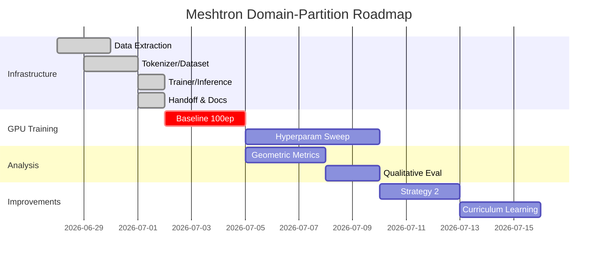

# Meshtron Domain-Partition Dashboard

> [!summary] Projekt-Status
> **Branch:** `domain_partition` | **Base:** `origin/tokenizer-sorting`  
> **Pipeline:** ✅ Vollständig | **GPU-Training:** 🔴 Pending  
> **Letzter Commit:** `da6888b` — Obsidian Tracker + Handoff

---

## 🎯 Aktive Ziele

| Ziel | Status | Blocker | Nächster Schritt |
|------|--------|---------|------------------|
| GPU-Baseline-Training | 🔴 Nicht gestartet | GPU-Rechner | Branch auschecken, Config kopieren, `domain_trainer.py` starten |
| Optuna-Sweep | 🟡 Blocked | Warte auf Baseline-Ergebnisse | `sweep_domain.py` erstellen |
| Geometrische Metriken | 🟡 Blocked | Warte auf generierte Meshes | `metrics_domain.py` implementieren |
| Strategy 2 vervollständigen | 🟢 Offen | Zeit | `_build_sequence_vertex_first` implementieren |
| Curriculum Learning | 🟢 Offen | Zeit | `quantization_schedule` im Trainer |

---

## 📊 Experiment-Status

> [!tip] Neue Experimente hier eintragen. Automatisch via Dataview filterbar.

| Experiment | Status | Config | Ergebnisse | Notizen |
|-----------|--------|--------|-----------|---------|
| CPU-Smoke-10ep | ✅ Done | d_model=128, 10ep | Loss 3.59→0.95 | Siehe [[meshtron-domain-obsidian.md]] |
| CPU-Smoke-Trainer | ✅ Done | d_model=128, 2ep | Trainer init OK | [[domain_trainer.py]] funktioniert |
| **GPU-Baseline-100ep** | 🔴 Geplant | d_model=512, bf16, b16 | — | **NÄCHSTES** |
| Strategy-Sweep | 🔴 Geplant | 3×3 Grid | — | Nach Baseline |
| Quantization-Sweep | 🔴 Geplant | r=[64,128,256,512] | — | Nach Strategy-Sweep |

---

## 🔥 Offene Blocker

> [!warning] Diese Items blocken Fortschritt

```dataview
TASK FROM [[meshtron-domain-obsidian.md]]
WHERE !completed AND priority = "critical"
```

**Manuelle Liste (falls Dataview nicht installiert):**

- [ ] GPU-Training starten `priority::critical`
- [ ] GradScaler-Deprecation fixen `priority::high`
- [ ] Erste Inference-Qualität bewerten `priority::high`

---

## ✅ Offene Aufgaben (Alle)

### Dringend
- [ ] **GPU-Training starten** — Config aus [[handoff.md]] kopieren, auf GPU-Rechner ausführen
- [ ] **GradScaler fixen** — `torch.amp.GradScaler('cuda', ...)` statt deprecated `torch.cuda.amp.GradScaler`

### Wichtig
- [ ] Optuna-Sweep implementieren (`sweep_domain.py`)
- [ ] Geometrische Metriken: Chamfer-Distanz, Edge-Curvature-Error
- [ ] Training-Ergebnisse dokumentieren (Plots + Metrics)

### Optional
- [ ] Strategy 2 (vertex-first) vervollständigen
- [ ] Curriculum Learning (coarse → fine quantization)
- [ ] Tangenten-Verbesserung (K=5/10 statt K=3)

---

## 📈 Training-Metriken (Live)

> [!note] Nach dem ersten GPU-Run hier aktualisieren. Am besten automatisiert via Script.

| Metrik | Baseline-100ep | Strategy-Sweep-Best | Ziel |
|--------|---------------|---------------------|------|
| Train Loss | — | — | < 0.5 |
| Val Loss | — | — | < 1.0 |
| Perplexity | — | — | < 5.0 |
| Seq Length Acc | — | — | ±5 Tokens |
| Face Count Acc | — | — | 100% |
| Chamfer Dist | — | — | < 0.01 |
| Edge Curv RMSE | — | — | < 0.05 |
| Training Time | — | — | < 2h/100ep |

---

## 🔗 Schnell-Links

### Code
- [[meshtron-domain-obsidian.md]] — Haupt-Tracker (Tasks, Experiments, Daily Log)
- [[handoff.md]] — Vollständiger Kontext für neue AI / GPU-Rechner
- [[plan.md]] — Ursprünglicher Architektur-Plan
- [[progress.md]] — Detaillierter Fortschritt (veraltet, nutze Obsidian-Tracker)

### Training & Inference
- `domain_trainer.py` — Moderner Trainer (bf16, cosine, JSONL logging)
- `inference_domain.py` — Autoregressive Sampling + Rekonstruktion
- `train_domain.py` — Einfacher Trainer (legacy, nicht mehr nutzen)

### Kern-Module
- `domain_extractor.py` — Preprocessing
- `tokenizer_domain.py` — Tokenisierung (3 strategies, 3 modes)
- `dataset_domain.py` — Dataset mit point-cloud sampling
- `domain_embedding.py` — Embedding wrapper
- `meshtron_domain.py` — Modell-Definition
- `reconstruct_domain.py` — Hermite-Splines + Transfinite Interpolation

### Visualisierung
- `plot_domain_pipeline.py` — 6-Phase Pipeline-Plots
- `plot_training.py` — Loss-Kurven + Token-Verteilung

### Referenz (Original)
- `trainer.py` — Original-Trainer
- `sweep.py` — Optuna-Sweep Referenz
- `tokenizer_v2.py` — Tokenizer V2 Referenz

---

## 🗺️ Projekt-Timeline



---

## 🐛 Bekannte Bugs — Live-Status

| Bug | Schwere | Status | Workaround | Fix-Datei |
|-----|---------|--------|-----------|-----------|
| CPU-only tested | ℹ️ Info | 🔴 Nicht fixbar | Auf GPU wechseln | — |
| Outlier meshes (16-20 faces) | ⚠️ Low | 🟡 Akzeptiert | max_seq_length angepasst | `dataset_domain.py` |
| Gmsh reinit möglich | ⚠️ Low | 🟡 Akzeptiert | Einmal pro Prozess nutzen | `reconstruct_domain.py` |
| Strategy 2 unvollständig | ⚠️ Medium | 🔴 Offen | Strategy 0/1 nutzen | `tokenizer_domain.py` |
| OpenMesh fehlt | ⚠️ Low | 🟡 Akzeptiert | Pure-Python Alternative | `reconstruct_domain.py` |
| GradScaler deprecated | ⚠️ Medium | 🔴 Offen | Ignorieren (funktioniert) | `domain_trainer.py` Z.92 |

---

## 📋 Daily Standup (Letzte 3 Tage)

> [!example] Hier kurze Updates eintragen — max 3 Bullet points pro Tag

**2026-07-01**
- ✅ `domain_trainer.py` + `inference_domain.py` fertig
- ✅ Smoke-Test Trainer OK (2 Epochen)
- ✅ Branch gepusht + Handoff + Obsidian Tracker erstellt

**2026-06-30**
- ✅ Rekonstruktion round-trip OK (12 → 17 edges → 532 verts)
- ✅ Embedding + Modell implementiert
- ✅ 10-Epoch CPU-Smoke-Test: Loss sinkt, Länge gelernt

**2026-06-29**
- ✅ Tokenizer mit 3 strategies, 3 modes, sincos
- ✅ Dataset mit point-cloud sampling
- ✅ Edge-index Refactor (per-edge statt per-vertex)

---

## 🛠️ Werkzeuge & Befehle

### Branch auschecken (neuer Rechner)
```bash
git fetch origin
git checkout -b domain_partition origin/domain_partition
```

### Training starten (GPU)
```bash
python -c "
from domain_trainer import DomainTrainer
from config import DomainTrainingConfig
cfg = DomainTrainingConfig(
    data_path='/root/repos/meshtron/domain_data.pt',
    quantization_r=256, quantization_a=128,
    sorting_strategy=0, embedding_mode=0,
    d_model=512, n_heads=8,
    stage_layers=(4, 8, 12, 16, 20),
    n_latents=512, batch_size=16,
    num_epochs=100, learning_rate=1e-4,
    warmup_steps=1000, precision='bf16',
    log_dir='runs_domain', save_best=True,
)
trainer = DomainTrainer(cfg)
trainer.run()
"
```

### Inference nach Training
```bash
python inference_domain.py \
  --run-dir runs_domain/<hash> \
  --ckpt best.pt \
  --temperature 1.0
```

### Metrics aus Logs extrahieren
```bash
python -c "
import json
for line in open('runs_domain/<hash>/metrics.jsonl'):
    d = json.loads(line)
    print(f'Epoch {d[\"epoch\"]}: train={d[\"train_loss\"]:.3f} val={d[\"val_loss\"]:.3f}')
"
```

---

## 📁 Datei-Struktur im Projekt

```
/root/repos/meshtron/
├── domain_extractor.py          ← Preprocessing
├── tokenizer_domain.py           ← Tokenisierung
├── dataset_domain.py              ← Dataset
├── domain_embedding.py            ← Embedding wrapper
├── meshtron_domain.py             ← Modell
├── domain_trainer.py              ← Trainer (modern)
├── inference_domain.py            ← Generierung
├── reconstruct_domain.py          ← Hermite + Transfinite
├── config.py                      ← Config (+ DomainTrainingConfig)
├── plot_domain_pipeline.py        ← Visualisierung
├── plot_training.py               ← Plots
├── train_domain.py                ← Legacy trainer (nicht nutzen)
├── sweep.py                       ← Original sweep (Referenz)
├── trainer.py                     ← Original trainer (Referenz)
├── plan.md                        ← Architektur-Plan
├── progress.md                    ← Alter Fortschritt
├── handoff.md                     ← Vollständiger Handoff
├── meshtron-domain-obsidian.md    ← Obsidian Tracker
├── dashboard-domain-partition.md  ← ← Dieses Dashboard
├── domain_data.pt                 ← Preprocessed data
└── runs_domain/                   ← Training outputs
```

---

## 🎯 Definition of Done

> [!success] Wann ist dieses Projekt "fertig"?

- [x] Pipeline vollständig (Extract → Tokenize → Train → Generate → Reconstruct)
- [ ] GPU-Baseline trainiert (100ep, d_model=512) mit Val Loss < 1.0
- [ ] Generierte Meshes sind visuell plausibel (keine degenerierten Faces)
- [ ] Optuna-Sweep zeigt beste Strategy + Embedding-Mode
- [ ] Geometrische Metriken implementiert und getrackt
- [ ] Inference-Skript produziert vergleichbare Meshes zu GT
- [ ] Dokumentation aktualisiert (plan.md, README falls vorhanden)
- [ ] Code auf `main` oder `tokenizer-sorting` gemerged

---

## 🔄 Wie dieses Dashboard nutzen

### Ohne Plugins
- Einfach als Markdown lesen
- Checkboxen manuell bearbeiten (`- [ ]` → `- [x]`)
- Tabellen manuell aktualisieren

### Mit Obsidian + Dataview
- Tasks automatisch filtern und aggregieren
- Experiment-Tabellen dynamisch aus anderen Notizen ziehen
- Dashboard als Startseite einrichten

### Mit Obsidian + Tracker Plugin
- Training-Loss-Kurven direkt im Dashboard plotten (YAML-Daten)
- Fortschritt über Zeit visualisieren

---

*Dashboard erstellt: 2026-07-01*  
*Nächste Aktualisierung: nach erstem GPU-Training-Run*
