# Motivation

## Block Structure Tokens

```{=html}
<figure style="margin:0; text-align:center; font-family:'IBM Plex Mono',monospace;">
<div style="display:flex; justify-content:center; gap:1rem; width:100%;">

  <div style="flex:1; border-radius:10px; padding:1.6rem 1.3rem; background:#cfe6ef; color:#0a2f3d;">
    <div style="font-size:1.0rem; font-weight:700; letter-spacing:0.03em; margin-bottom:0.6rem;">THE PROBLEM</div>
    <div style="font-size:2.6rem; font-weight:700; margin-bottom:0.6rem;">12,608 <span style="font-size:2.6rem; font-weight:600;">tokens</span></div>
    <div style="font-size:1.15rem; line-height:1.4;">The problem with CFD meshes generated by a transformer is that they are simply too large for autoregressive generation. You can see this in the test case on your left: a fine mesh with 1,576 faces already needs 12,608 tokens when tokenized face-by-face, pushing attention memory past 30GB for a modest transformer.</div>
  </div>

  <div style="flex:1; border-radius:10px; padding:1.6rem 1.3rem; background:#6fb3ca; color:#0a2f3d;">
    <div style="font-size:1.0rem; font-weight:700; letter-spacing:0.03em; margin-bottom:0.6rem;">LEVEL 1 — HOW WE REDUCE IT</div>
    <div style="font-size:2.6rem; font-weight:700; margin-bottom:0.6rem;">1,584 <span style="font-size:2.6rem; font-weight:600;">tokens</span></div>
    <div style="font-size:1.15rem; line-height:1.4;">The first lever is to not generate the fine mesh directly, but only a coarse block structure, shown on your right, which is refined afterward by transfinite interpolation. That alone cuts the sequence to 1,584 tokens, 87.4% fewer, and brings attention memory down to 482 MB.</div>
  </div>

  <div style="flex:1; border-radius:10px; padding:1.6rem 1.3rem; background:#0f4a63; color:#f3f2f2;">
    <div style="font-size:1.0rem; font-weight:700; letter-spacing:0.03em; margin-bottom:0.6rem;">LEVEL 2 — WHAT WE GENERATE</div>
    <div style="font-size:2.6rem; font-weight:700; margin-bottom:0.6rem;">1,022 <span style="font-size:2.6rem; font-weight:600;">tokens</span></div>
    <div style="font-size:1.15rem; line-height:1.4;">The second lever is how that same block structure is generated: ordering it row-by-row instead of face-by-face removes duplicate tokens and brings the sequence down to 1,022 tokens, a further 35.5% fewer, with attention memory down to 201 MB.</div>
  </div>

</div>

<div style="display:flex; justify-content:center; align-items:center; gap:1.5rem; width:100%; margin-top:1rem;">
  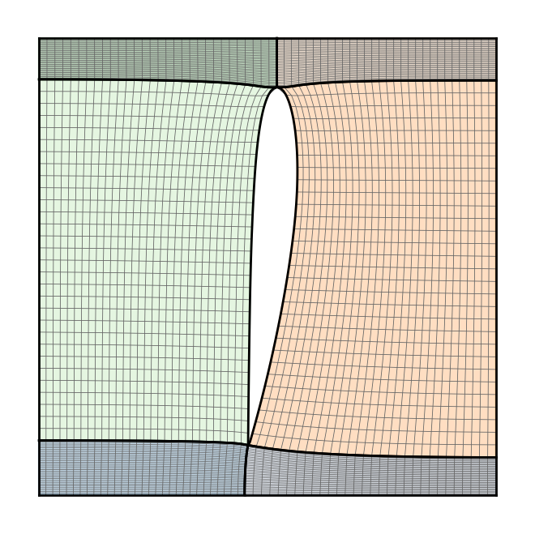
  <div style="font-size:2.6rem; font-weight:700; color:#0f4a63;">&harr;</div>
  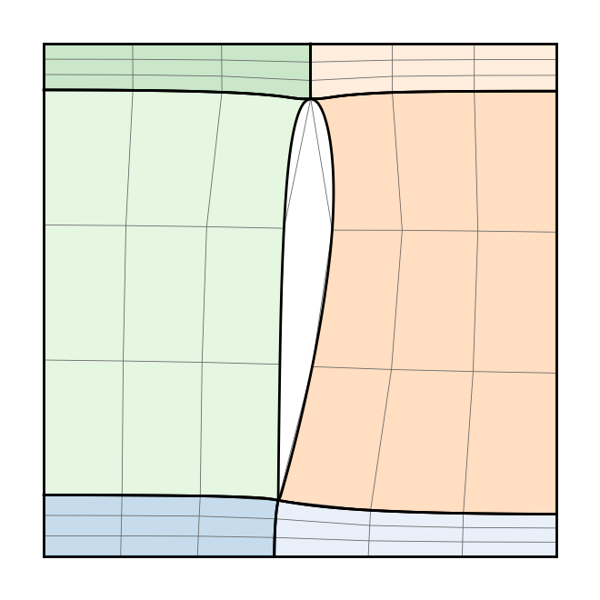
</div>

</figure>
```

::: {.notes}
The problem: even a small 2D test case, 1,576 faces, needs 12,608 tokens if you tokenize every face — already too long to generate autoregressively. Level 1 cuts that to 1,584 tokens by generating only the coarse block structure, refined afterward by transfinite interpolation — a 87.4% reduction, geometry-dependent. Level 2 cuts it further to 1,022 tokens: the row-structured ordering removes duplicate tokens, a further 35.5% reduction that holds regardless of geometry. Two independent levers, both attacking sequence length.
:::

# Introduction

## Why Order Matters

::: {.columns}
::: {.column width="46%"}
- Generation is autoregressive → tokens need a fixed sequence order

::: {.incremental}
- The mesh is hierarchical — faces → vertices → coordinates — but must
  flatten into one sequence
- Shared vertices retokenized every face 
- A regular, consistent ordering is easier for the transformer to
  learn than an arbitrary one
:::
:::
::: {.column width="54%"}
```{=html}
<div style="text-align:center; font-size:1.1rem; color:#d6006c; font-weight:700; margin-bottom:0.3rem;">
  Same mesh, different order &rarr; different sequence
</div>
<div style="text-align:center; font-weight:600; font-size:0.9rem; color:#201e1d; margin-bottom:0.6rem;">The mesh itself has no order. The tokenizer creates one.</div>
<div style="display:flex; justify-content:center;">
  <iframe src="embeds/why_order_animation.html" style="width:900px; max-width:100%; height:600px; border:2px solid #9a9490; border-radius:6px;" scrolling="no" frameborder="0"></iframe>
</div>
```
:::
:::

::: {.notes}
Generation is autoregressive, so we must fix an order in which tokens appear, and that position is itself embedded (positional encoding). The mesh itself is hierarchical — faces built from vertices, vertices built from coordinates — but that hierarchy has to be flattened into one linear sequence. And the order we pick isn't neutral: a regular, consistent pattern is far easier for the transformer to learn than an arbitrary one. The key insight: the mesh itself has no order, only a set of vertices and faces. The tokenizer creates one. Same 3x3 grid, two different face traversals, colored by order (blue=first, red=last) — completely different color pattern, completely different token sequence, for the identical mesh. That's why the ordering strategy is the whole talk.
:::


# Tokenization

## Lexicographic Tokenization {.title-s}

::: {.columns}
::: {.column width="42%"}
- **2-Step Sort**
  - Order each vertex within a face by $(y,x)$, forming a face tensor
  - Order the face tensors by $(y,x)$

::: {.incremental}
-  Vertex order within a face depends on face shape
  - Modern Method uses a boundary walk 
:::
:::
::: {.column width="58%"}
```{=html}
<div style="display:flex; justify-content:center;">
  <iframe src="embeds/tokenization_strat0.html" style="width:900px; max-width:100%; height:676px; border:2px solid #9a9490; border-radius:6px;" scrolling="no" frameborder="0"></iframe>
</div>
```
:::
:::

::: {.notes}
The first strategy we'll look at is a simple two-step sort. Within each face, we first order its four vertices by y then x, forming a face tensor, and we then order the face tensors themselves the same way. In the graphic on your right, this order is color-coded, from dark blue for the first quad to dark red for the last. The vertices within each face are already ordered, so if we walk face by face through the mesh, we get the token sequence visualized below the graphic. The problem is that the vertex order within each face doesn't have a fixed pattern, but depends on the shape of the face itself. We will see this on the next slide.
:::

## Lexicographic Tokenization {.title-s}

::: {.columns}
::: {.column width="48%"}

**The Problem — no structure to exploit**

- Order jumps across the mesh
  - face-order color scatters — mesh neighbours end up far apart in the sequence
- Every vertex re-tokenized per face
  - no compression possible — duplicates land at unpredictable positions
:::

::: {.column width="48%"}

```{=html}
<div style="display:flex;flex-direction:column;align-items:center;gap:0.5rem;">
  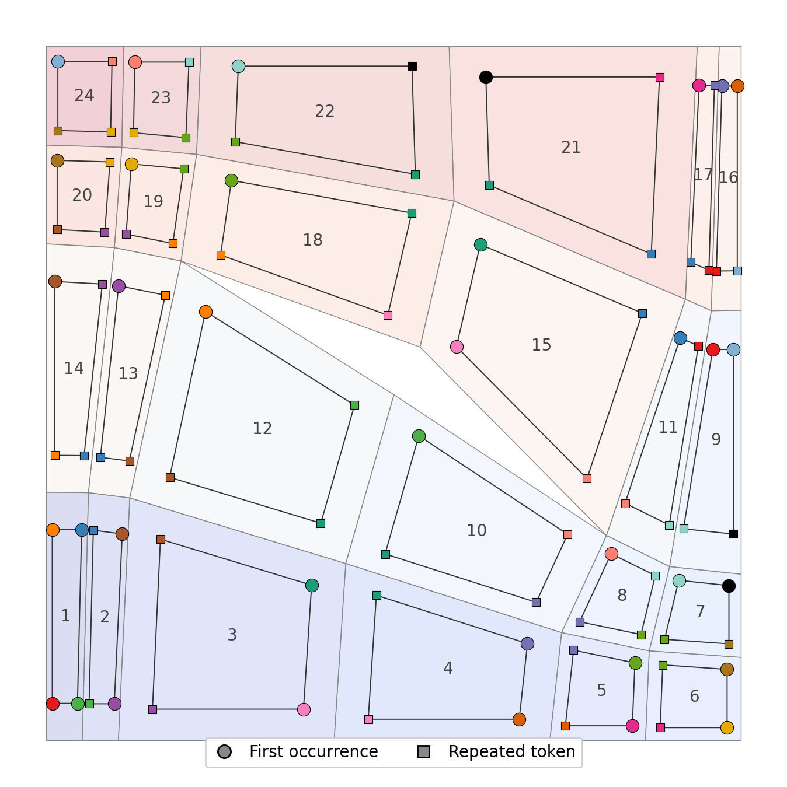
  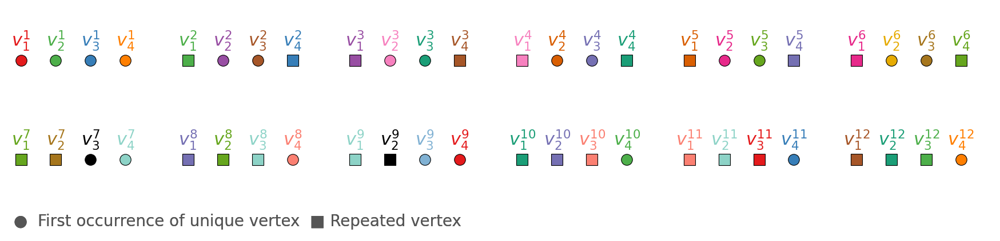
</div>
```

:::
:::

::: {.notes}
This is where the problem from the last slide really shows. On the mesh on your right, the faces are colored by their order, and you can see it jump around — look for example at faces 8 through 12. Neighboring faces in the mesh end up scattered in the sequence, with no structure to exploit. And because every vertex gets re-tokenized whenever it shows up in a new face, there's no way to compress that — the sequence below shows the first twelve faces, and you can see the same tokens reappearing, but never at a predictable position.
:::

## Our Solution: Adjacency-Preserving Tokenization {.title-s}

::: {.columns}
::: {.column width="42%"}
- **2-Step Sort** (as on the previous slide) → face-tensor stack

::: {.incremental}
- **Half-Edge Boundary Walk**
  - Take the first tensor in the stack
  - Walk to adjacent faces clockwise via the half-edge structure
  - Remove visited faces from the stack
  - No adjacent face left → repeat from 1 with the next stack entry
:::
:::
::: {.column width="58%"}
```{=html}
<div style="display:flex; justify-content:center;">
  <iframe src="embeds/tokenization_strat3.html" style="width:900px; max-width:100%; height:676px; border:2px solid #9a9490; border-radius:6px;" scrolling="no" frameborder="0"></iframe>
</div>
```
:::
:::

::: {.notes}
Our solution starts exactly the same way as the previous slide: the same two-step sort builds a stack of face tensors, ordered by y then x. But instead of just reading that stack straight through, we use it differently. We take the first tensor off the stack, then walk clockwise to its adjacent faces using a half-edge data structure, removing each face from the stack as we visit it. Once there's no adjacent face left to walk to, we go back to the stack, take the next one, and repeat. You can see this play out on the same four-face grid as before in the animation on the right: the face order comes out identical to the earlier strategy on this uniform mesh, but watch what happens differently in the token bar. The exit edge of a face is always the reversed entry edge of the next face within a row. And we move on to the next slide to see that this method is really robust for block-structured quad meshes.
:::

## Our Solution: Adjacency-Preserving Tokenization

::: {.columns}
::: {.column width="42%"}

- **Result:** last 2 vertices of face $i$ = first 2 of face $i+1$
- discontinuities only between rows, not within faces
- **predictable** repeated token positions
- duplicated vertices within each row can be avoided by adding an end of row token
:::
::: {.column width="58%"}
```{=html}
<div style="display:flex;flex-direction:column;align-items:center;gap:0.5rem;">
  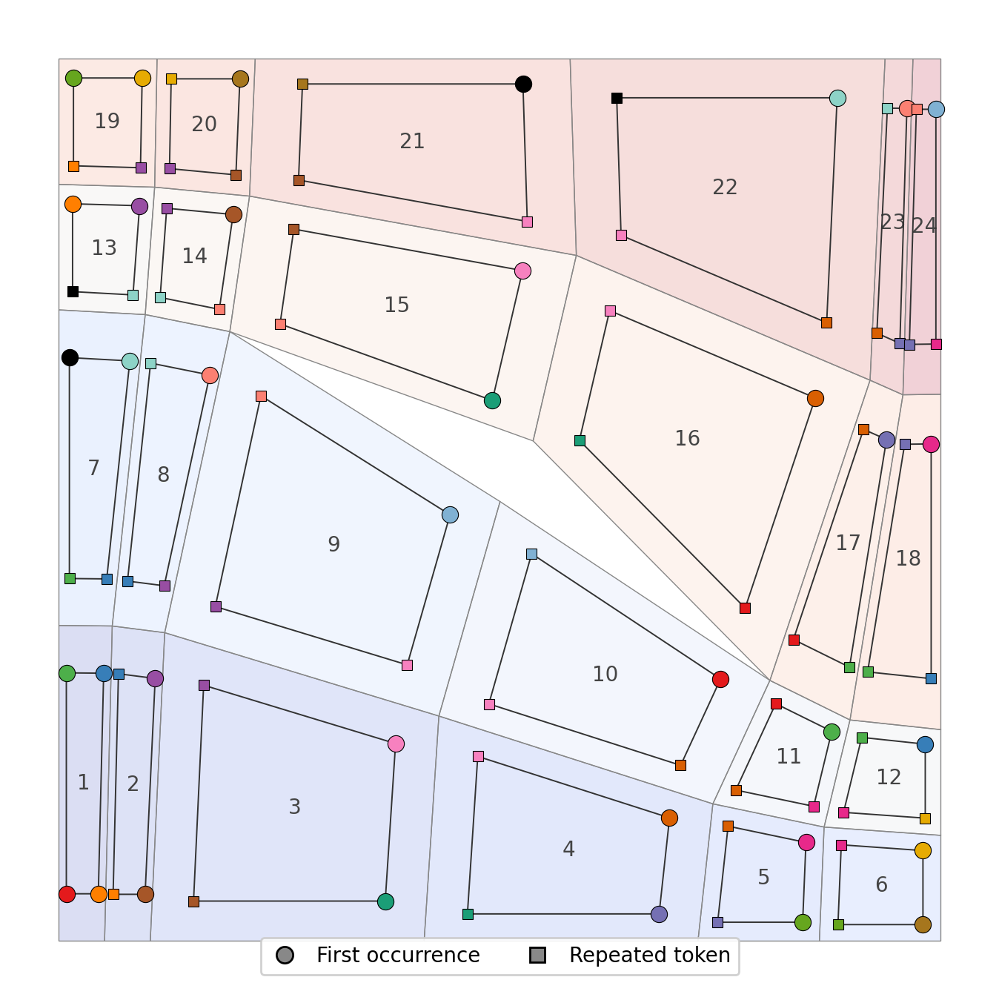
  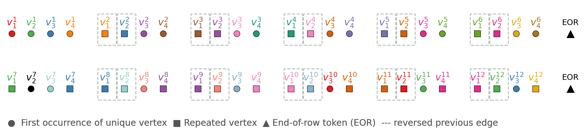
</div>
```
:::
:::

::: {.notes}
The result: the last two vertices of one face are exactly the first two of the next, and discontinuities in the sequence happen only between rows, never within one row. In our experiments, we compared two versions of this: one that keeps the duplicated vertices, just with this now-predictable pattern, and one that removes the duplicated vertices within each row and instead marks the row's end with an additional end-of-row token.
:::

# Benchmark

## Transformer Architecture

::: {.columns}
::: {.column width="46%"}

**Geometric conditioning:**

- **Point Perceiver Encoder** — input point cloud (Delaunay triangulation) → fixed set of latent embeddings
- **Face Count Encoder** — sinusoidal encoding of desired face count → density control

**Positional encoding:**

- **RoPE** (Rotary Positional Embeddings) — encodes relative positions directly in attention; extrapolates to unseen sequence lengths

**Parameters** optimized via **Optuna** (3-stage HPO).

- $n$ stages, each: $m$ masked self-attention layers + 1 cross-attention


:::
::: {.column width="54%"}
```{=html}
<figure style="margin:80px 0 0;text-align:center;">
<svg viewBox="0 0 690 640" role="img" aria-label="Transformer architecture in the classic encoder-decoder layout: our Point Perceiver / Face Count encoder on the left produces a K,V context; the decoder on the right runs n repeated pre-norm stages — masked self-attention, cross-attention and feed-forward, each with LayerNorm and a residual connection — against that context, ending in softmax"
     style="width:100%;max-width:640px;height:auto;overflow:visible;font-family:'IBM Plex Mono',monospace;">
<defs>
<marker id="aa" viewBox="0 0 10 10" refX="8" refY="5" markerWidth="6" markerHeight="6" orient="auto-start-reverse"><path d="M0,0 L10,5 L0,10 z" fill="#201e1d"/></marker>
<marker id="ab" viewBox="0 0 10 10" refX="8" refY="5" markerWidth="6" markerHeight="6" orient="auto-start-reverse"><path d="M0,0 L10,5 L0,10 z" fill="#006786"/></marker>
<marker id="ac" viewBox="0 0 10 10" refX="8" refY="5" markerWidth="5" markerHeight="5" orient="auto-start-reverse"><path d="M0,0 L10,5 L0,10 z" fill="#6b6663"/></marker>
</defs>

<!-- LEFT COLUMN: Encoder (our geometric conditioning) -->
<rect x="20" y="20" width="120" height="62" rx="6" fill="#eae9e9" stroke="#9a9490" stroke-width="1.5"/>
<text x="80" y="46" text-anchor="middle" style="fill:#201e1d;font-size:13px;font-weight:600;">Point Cloud</text>
<text x="80" y="63" text-anchor="middle" style="fill:#6b6663;font-size:11px;">Delaunay tri.</text>

<rect x="160" y="20" width="120" height="62" rx="6" fill="#eae9e9" stroke="#9a9490" stroke-width="1.5"/>
<text x="220" y="46" text-anchor="middle" style="fill:#201e1d;font-size:13px;font-weight:600;">Face Count</text>
<text x="220" y="63" text-anchor="middle" style="fill:#6b6663;font-size:11px;">desired # faces</text>

<line x1="80" y1="82" x2="80" y2="108" stroke="#201e1d" stroke-width="1.5" marker-end="url(#aa)"/>
<line x1="220" y1="82" x2="220" y2="108" stroke="#201e1d" stroke-width="1.5" marker-end="url(#aa)"/>

<rect x="10" y="112" width="280" height="196" rx="10" fill="#f3f2f2" stroke="#0088b0" stroke-width="2.5"/>
<text x="150" y="138" text-anchor="middle" style="fill:#0088b0;font-size:16px;font-weight:700;letter-spacing:0.08em;">ENCODER</text>

<rect x="30" y="150" width="105" height="96" rx="6" fill="#e0f2f8" stroke="#0088b0" stroke-width="1.5"/>
<text x="82" y="192" text-anchor="middle" style="fill:#201e1d;font-size:12.5px;font-weight:600;">Point Perceiver</text>
<text x="82" y="210" text-anchor="middle" style="fill:#0088b0;font-size:12.5px;">Encoder</text>

<rect x="165" y="150" width="105" height="96" rx="6" fill="#e0f2f8" stroke="#0088b0" stroke-width="1.5"/>
<text x="217" y="192" text-anchor="middle" style="fill:#201e1d;font-size:12.5px;font-weight:600;">Sinusoidal</text>
<text x="217" y="210" text-anchor="middle" style="fill:#0088b0;font-size:12.5px;">Encoder</text>

<text x="150" y="288" text-anchor="middle" style="fill:#006786;font-size:13px;font-weight:600;">concat</text>

<line x1="150" y1="308" x2="150" y2="332" stroke="#006786" stroke-width="1.5" marker-end="url(#ab)"/>
<rect x="65" y="336" width="170" height="60" rx="8" fill="#e8f4ed" stroke="#006786" stroke-width="2"/>
<text x="150" y="372" text-anchor="middle" style="fill:#006786;font-size:15px;font-weight:600;">K, V context</text>

<!-- connector: encoder output -> decoder cross-attention (unit 2, ~y=317) -->
<path d="M235,366 L300,366 L300,317 L365,317" fill="none" stroke="#006786" stroke-width="2" marker-end="url(#ab)"/>

<!-- RIGHT COLUMN: Decoder (main flow) -->
<rect x="345" y="20" width="270" height="62" rx="8" fill="#eae9e9" stroke="#9a9490" stroke-width="1.5"/>
<text x="480" y="46" text-anchor="middle" style="fill:#201e1d;font-size:16px;font-weight:600;">Token Sequence</text>
<text x="480" y="64" text-anchor="middle" style="fill:#6b6663;font-size:13px;">x₁ … xₜ (causal)</text>

<line x1="480" y1="82" x2="480" y2="112" stroke="#201e1d" stroke-width="2" marker-end="url(#aa)"/>

<rect x="330" y="116" width="300" height="402" rx="10" fill="#f3f2f2" stroke="#d6006c" stroke-width="2.5"/>
<text x="480" y="144" text-anchor="middle" style="fill:#d6006c;font-size:16px;font-weight:700;letter-spacing:0.08em;">n STAGES (pre-norm)</text>

<!-- Sublayer 1: Masked Self-Attention -->
<circle cx="480" cy="150" r="2.5" fill="#201e1d"/>
<path d="M480,150 L615,150 L615,246 L489,246" fill="none" stroke="#6b6663" stroke-width="1.3" marker-end="url(#ac)"/>
<text x="480" y="164" text-anchor="middle" style="fill:#6b6663;font-size:10.5px;font-style:italic;">LayerNorm</text>
<rect x="365" y="168" width="230" height="62" rx="6" fill="#fce8f1" stroke="#d6006c" stroke-width="1.5"/>
<text x="480" y="194" text-anchor="middle" style="fill:#201e1d;font-size:14.5px;font-weight:600;">m × Masked Self-Attn</text>
<text x="480" y="212" text-anchor="middle" style="fill:#6b6663;font-size:12px;">+ RoPE · causal</text>
<line x1="480" y1="230" x2="480" y2="237" stroke="#201e1d" stroke-width="1.5"/>
<circle cx="480" cy="246" r="9" fill="#fff" stroke="#201e1d" stroke-width="1.5"/>
<text x="480" y="250" text-anchor="middle" style="fill:#201e1d;font-size:12px;font-weight:700;">+</text>
<line x1="480" y1="255" x2="480" y2="268" stroke="#201e1d" stroke-width="1.5" marker-end="url(#aa)"/>

<!-- Sublayer 2: Cross-Attention -->
<circle cx="480" cy="268" r="2.5" fill="#201e1d"/>
<path d="M480,268 L615,268 L615,364 L489,364" fill="none" stroke="#6b6663" stroke-width="1.3" marker-end="url(#ac)"/>
<text x="480" y="282" text-anchor="middle" style="fill:#6b6663;font-size:10.5px;font-style:italic;">LayerNorm</text>
<rect x="365" y="286" width="230" height="62" rx="6" fill="#e8f4ed" stroke="#006786" stroke-width="1.5"/>
<text x="480" y="312" text-anchor="middle" style="fill:#201e1d;font-size:14.5px;font-weight:600;">Cross-Attention</text>
<text x="480" y="330" text-anchor="middle" style="fill:#6b6663;font-size:12px;">Q=tokens · K,V=context</text>
<line x1="480" y1="348" x2="480" y2="355" stroke="#201e1d" stroke-width="1.5"/>
<circle cx="480" cy="364" r="9" fill="#fff" stroke="#201e1d" stroke-width="1.5"/>
<text x="480" y="368" text-anchor="middle" style="fill:#201e1d;font-size:12px;font-weight:700;">+</text>
<line x1="480" y1="373" x2="480" y2="386" stroke="#201e1d" stroke-width="1.5" marker-end="url(#aa)"/>

<!-- Sublayer 3: Feed-Forward -->
<circle cx="480" cy="386" r="2.5" fill="#201e1d"/>
<path d="M480,386 L615,386 L615,482 L489,482" fill="none" stroke="#6b6663" stroke-width="1.3" marker-end="url(#ac)"/>
<text x="480" y="400" text-anchor="middle" style="fill:#6b6663;font-size:10.5px;font-style:italic;">LayerNorm</text>
<rect x="365" y="404" width="230" height="62" rx="6" fill="#fdf1d0" stroke="#edbb00" stroke-width="1.5"/>
<text x="480" y="430" text-anchor="middle" style="fill:#201e1d;font-size:14.5px;font-weight:600;">Feed-Forward</text>
<text x="480" y="448" text-anchor="middle" style="fill:#6b6663;font-size:12px;">position-wise MLP</text>
<line x1="480" y1="466" x2="480" y2="473" stroke="#201e1d" stroke-width="1.5"/>
<circle cx="480" cy="482" r="9" fill="#fff" stroke="#201e1d" stroke-width="1.5"/>
<text x="480" y="486" text-anchor="middle" style="fill:#201e1d;font-size:12px;font-weight:700;">+</text>
<line x1="480" y1="491" x2="480" y2="542" stroke="#201e1d" stroke-width="2" marker-end="url(#aa)"/>

<line x1="645" y1="116" x2="645" y2="518" stroke="#d6006c" stroke-width="1.5"/>
<text x="658" y="317" text-anchor="middle" transform="rotate(90 658 317)" style="fill:#d6006c;font-size:13px;">repeat n times</text>

<rect x="365" y="542" width="230" height="62" rx="6" fill="#eae9e9" stroke="#9a9490" stroke-width="1.5"/>
<text x="480" y="578" text-anchor="middle" style="fill:#201e1d;font-size:15px;font-weight:600;">Softmax → next token</text>
</svg>
</figure>
```
:::
:::

::: {.notes}
Now let's look at the actual transformer architecture. On the left, our encoder takes two conditioning inputs. A Point Perceiver Encoder processes the input point cloud, built from a Delaunay triangulation, into a fixed set of latent embeddings, while a Face Count Encoder sinusoidally encodes the desired number of faces to control mesh density. Both get concatenated into the key and value context that feeds the decoder's cross-attention. For positional encoding we use RoPE, rotary positional embeddings, which encode relative position directly inside attention and extrapolate well to sequence lengths we haven't trained on. The decoder itself, on the right, runs n stages, each with m masked self-attention layers followed by one cross-attention layer into that context, and all the hyperparameters — n, m, and the rest — were tuned with a three-stage Optuna search.
:::

## Data: Domain Partition

::: {.columns}
::: {.column width="48%"}
**Dataset:** 2000 turbine blade profiles

- Random **naca** profil
  - Random scale factor: 0.50 – 0.95
  - Random rotation: −π/4 to +π/4
- **Domain partition pipeline:**
  - Boundary crosses from local normals & tangents
  - Frame field propagation to interior
  - Singularity detection via **Poincaré index**
  - Streamlines from singularities along cross-field

- **Restriction:** meshes with 6 faces only

- **Data Augmentation**

:::
::: {.column width="52%"}
::: {.r-stack}
```{=html}
<figure style="text-align:center;margin:0.3em 0;">
<div style="display:flex;flex-direction:column;gap:0.35rem;align-items:center;">
  <div style="text-align:center;display:flex;align-items:center;gap:0.7rem;">
    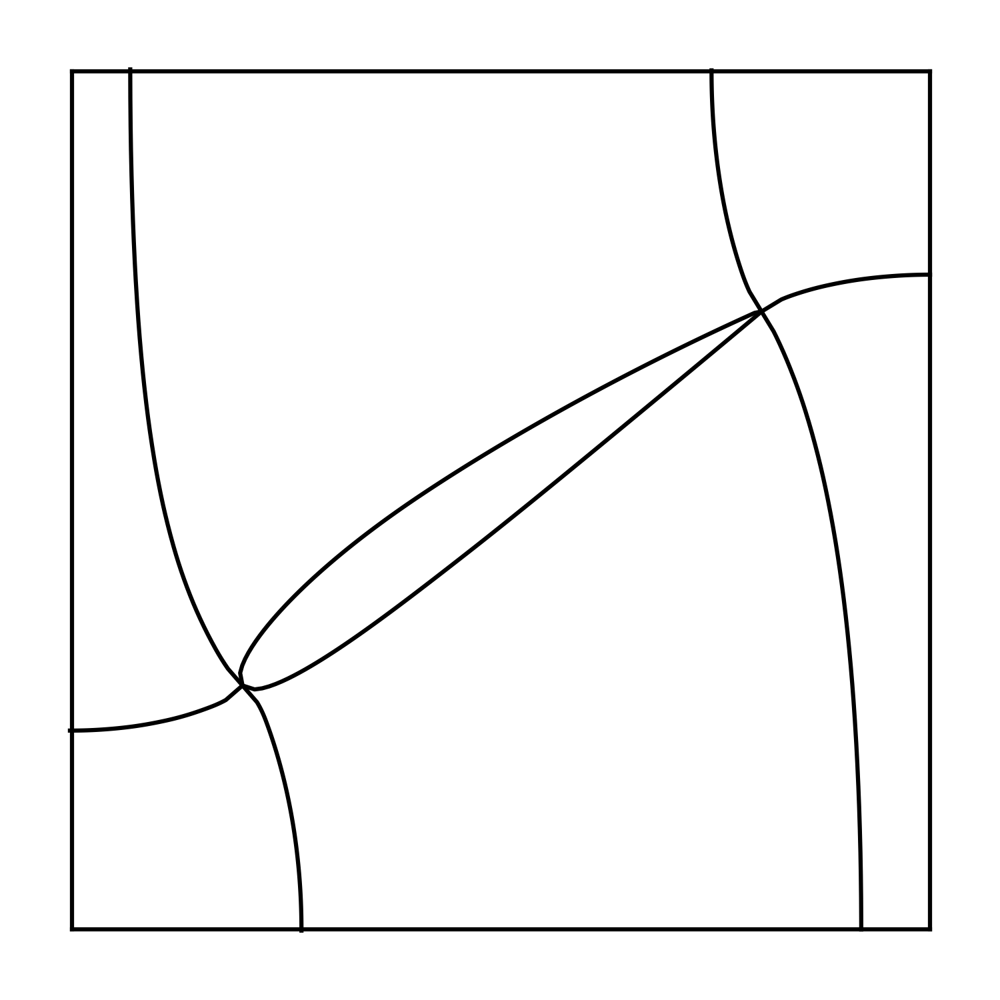
    <div style="font-size:0.7rem;color:#6b6663;font-family:'IBM Plex Mono',monospace;">Streamlines · 6 blocks</div>
  </div>
  <div style="text-align:center;display:flex;align-items:center;gap:0.7rem;">
    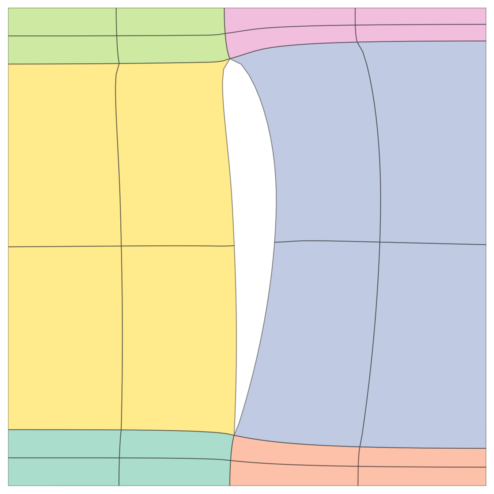
    <div style="font-size:0.7rem;color:#6b6663;font-family:'IBM Plex Mono',monospace;">1× subdiv · 4 blocks</div>
  </div>
  <div style="text-align:center;display:flex;align-items:center;gap:0.7rem;">
    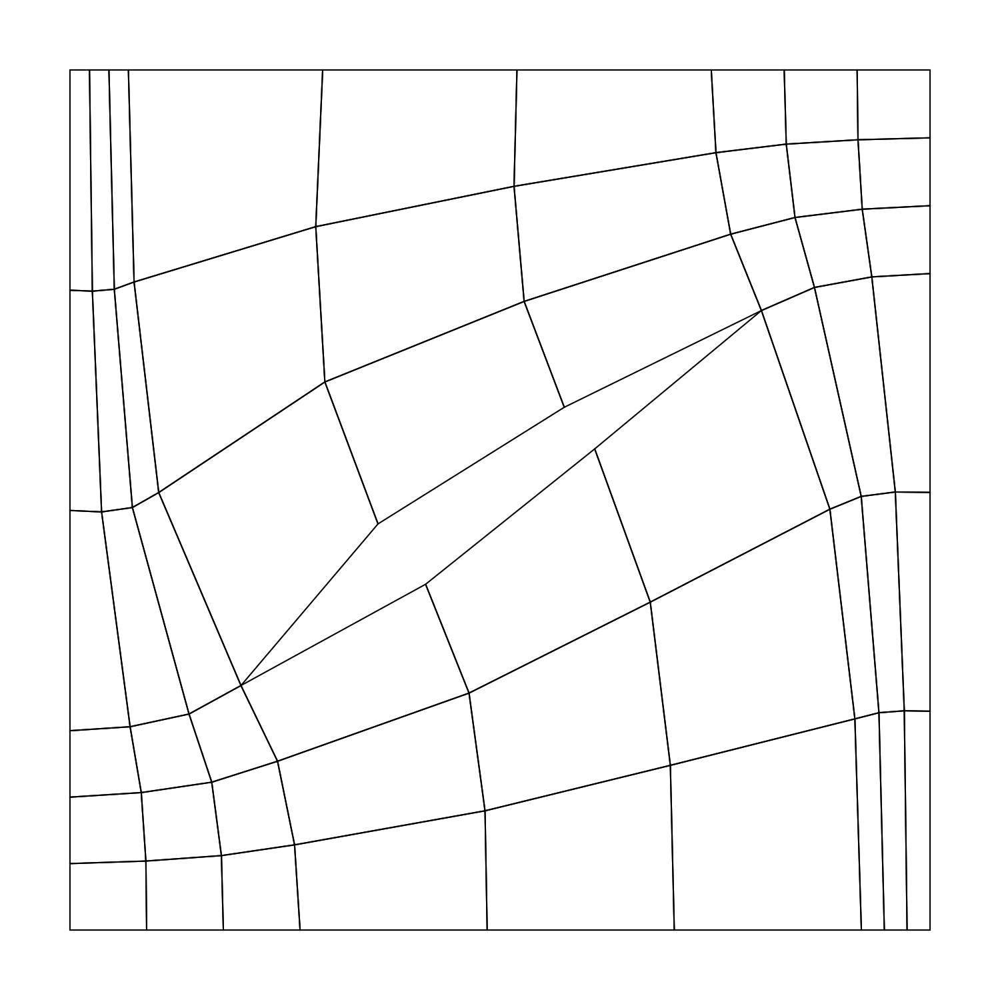
    <div style="font-size:0.7rem;color:#6b6663;font-family:'IBM Plex Mono',monospace;">2× subdiv · 9 blocks</div>
  </div>
</div>
</figure>
```
:::
:::
:::


## Results: Tokenization Comparison

::: {.columns}
::: {.column width="55%"}

- Optuna-optimized configs 
  - 3 stage optimization 
  - 2 independent HPO runs each Method
  - Same seeds for each Method

| Strategy | BPT | Tokens | GPU | BPM | Acc. |
|---|---|---|---|---|---|
| Lexicographic | 0.388 | 448 | 15 866 MiB | 173.8 | 76.4% |
| **Adj.-Pres.** | **0.340** | 448 | 15 866 MiB | 152.3 | **79.0%** |
| **Sparse** | 0.551 | **272** | **8 379 MiB** | **149.9** | 68.3% |

**BPM** = BPT × tokens/mesh — holistic efficiency metric.

- **Adjacency-preserving:** best per-token prediction quality (+12.4% accuracy vs lex)
- **Sparse:** best overall efficiency (BPM 149.9) + 52.8% less GPU memory


:::
::: {.column width="45%"}

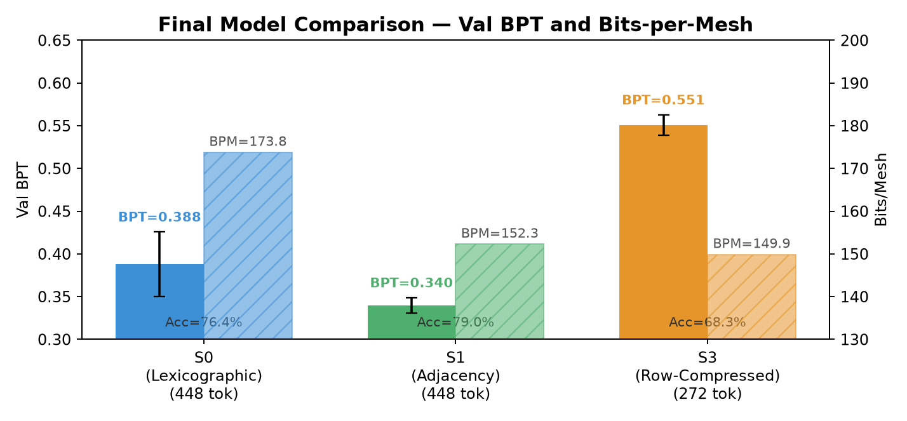{height="380"}
:::
:::

::: {.notes}
The final comparison table tells two stories. Adjacency-preserving is the winner on per-token quality: BPT 0.340 vs 0.388 for lexicographic, accuracy 79% vs 76.4%. The structural coherence pays off directly. Sparse Row-Structured has higher per-token BPT — shorter sequences are harder to predict per token — but because sequences are 39% shorter, bits-per-mesh drops to 149.9, the lowest of all three. Combined with 52.8% GPU memory reduction (quadratic attention), Sparse enables training on much cheaper hardware and will scale better to larger meshes.
:::

# Summary

## Two Levels of Token Reduction for Transformer-Based Mesh Generation
- **Problem:** naive per-face tokenization explodes — 1,576 faces → 12,608 tokens, >30 GB attention memory
- **Solution:** coarse block structure (TFI-refined) + row-structured ordering → up to 92% fewer tokens (1,022), 201 MB attention memory
- **Adjacency-preserving ordering:** +12.4% accuracy vs. lexicographic baseline
- **Sparse row-structured:** best overall efficiency — 39% shorter sequences, −52.8% GPU memory

::: {.notes}
Pulling it together: the problem was sequence length — a small 2D mesh already needs 12,608 tokens and blows past 30GB of attention memory. Our two-level solution — coarse block structure refined by TFI, then row-structured ordering — cuts that down to 1,022 tokens and 201MB, a 92% reduction. On top of the length savings, the ordering strategy itself matters for quality: adjacency-preserving ordering beats the lexicographic baseline by 12.4% accuracy. And the sparse row-structured variant is the most efficient overall — 39% shorter sequences and 52.8% less GPU memory — the best choice when scaling to larger meshes.
:::

# Outlook

## 3D Case: NACA Profile

::: {.columns}
::: {.column width="42%"}
- Block-structure approach isn't limited to 2D
- Profile extrudes along the span → 3D domain
- TFI refines volumetrically too ($n=3$, $n=4$ fine) — same principle, one dimension more
:::
::: {.column width="58%"}
```{=html}
<div style="display:flex; justify-content:center; gap:1rem;">
  <div style="flex:1; text-align:center;">
    <iframe src="embeds/hexa_curved_tfi_multi.html" style="width:100%; height:440px; border:2px solid #9a9490; border-radius:6px;" scrolling="no" frameborder="0"></iframe>
    <div style="font-size:0.8rem; color:#6b6663; margin-top:0.3rem;">block partition + TFI levels</div>
  </div>
</div>
```
:::
:::

::: {.notes}
The block-structure idea generalizes directly to 3D. Take the same NACA profile, extrude it along the blade span, and you get a 3D domain instead of a 2D one — same boundary, one more dimension. The block partition carries over unchanged, and transfinite interpolation refines volumetrically instead of planarly: here at n=3 and a finer n=4. Same principle throughout, just one dimension more.
:::

## 3D Case: Turbine

```{=html}
<figure style="margin:0; text-align:center; font-family:'IBM Plex Mono',monospace;">

<!-- Row 1: Images (same height) -->
<div style="display:flex; justify-content:center; gap:1.5rem; width:100%;">
  <div style="flex:1;">
    <iframe src="embeds/tistos_2d.html" style="width:100%; height:400px; border:2px solid #9a9490; border-radius:6px;" scrolling="no" frameborder="0"></iframe>
  </div>
  <div style="flex:1;">
    <div style="border:2px solid #0088b0; border-radius:6px; padding:3px; background:#e0f2f8; height:400px; display:flex; align-items:center; justify-content:center;">
      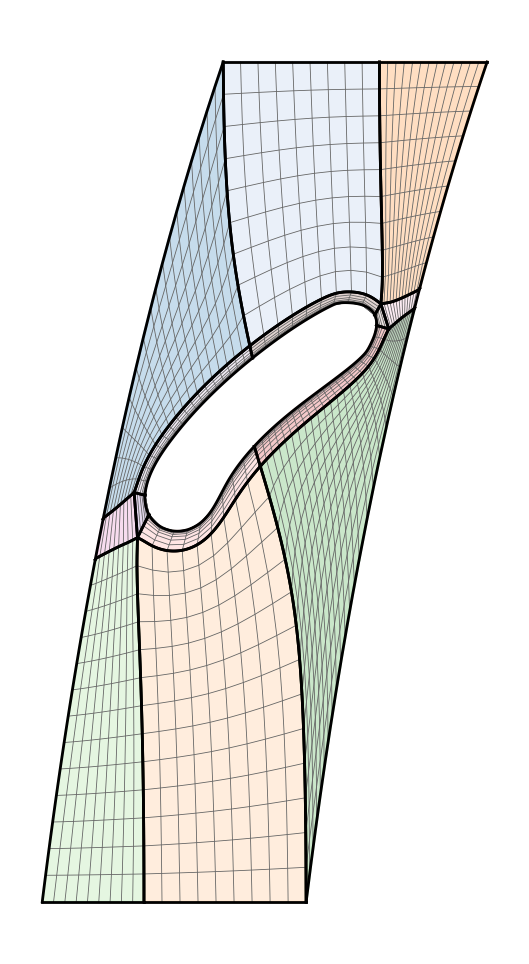
    </div>
  </div>
  <div style="flex:1;">
    <div style="border:2px solid #006786; border-radius:6px; padding:3px; background:#e8f4ed; height:400px; display:flex; align-items:center; justify-content:center;">
      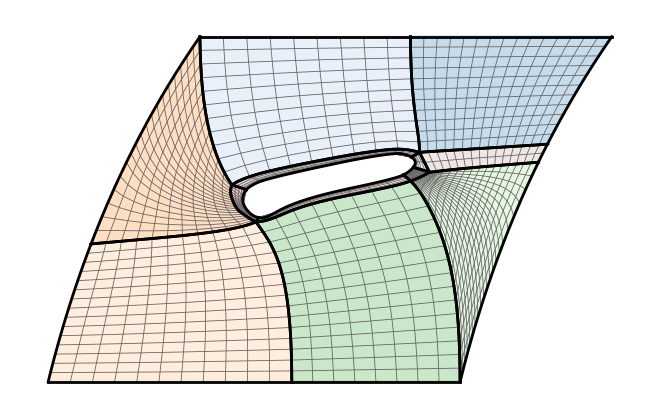
    </div>
  </div>
</div>

<!-- Row 2: Titles (same height, same font size) -->
<div style="display:flex; justify-content:center; gap:1.5rem; width:100%; margin-top:0.3rem;">
  <div style="flex:1; color:#201e1d; font-size:1.2rem; font-weight:600;">3D Turbine</div>
  <div style="flex:1; color:#0088b0; font-size:1.2rem; font-weight:600;">2D Hub</div>
  <div style="flex:1; color:#006786; font-size:1.2rem; font-weight:600;">2D Shroud</div>
</div>

<!-- Row 3: Descriptions in boxes matching panel widths -->
<div style="display:flex; justify-content:center; gap:1.5rem; width:100%; margin-top:0.8em;">
  <div style="flex:1; border:2px solid #d6006c; border-radius:6px; padding:3px; background:#fce8f1; text-align:center; font-size:1.05rem; color:#d6006c;">10<sup>6+</sup> elements &rarr; 4M tokens &rarr; infeasible</div>
  <div style="flex:2; border:2px solid #0088b0; border-radius:6px; padding:3px; background:#e0f2f8; text-align:center; font-size:1.05rem; color:#201e1d;">6 blocks &rarr; 6 hexa &rarr; 36 quads &rarr; <strong style="color:#0088b0;">304 tokens</strong></div>
</div>

</figure>
```

::: {.notes}
Work in progress: extending from 2D block structures to full 3D. Turbomachinery CFD requires high-quality structured meshes. A full 3D CFD mesh has millions of elements — direct vertex-wise tokenization yields ~4M tokens, infeasible for any autoregressive model. Our approach: unwrap the hub and shroud surfaces to 2D, generate coarse quad block structures (6 blocks per surface), then extrude back to 3D (6 hexa blocks, 36 quad face instances). Tokenizing these 36 quads yields only 304 tokens — a reduction of 4 orders of magnitude.
:::

# Acknowledgements

## Attention is all we need — Thank you for yours!

```{=html}
<div style="text-align:center; margin-top:1.5rem;">
  <div style="font-size:1.7rem; color:#201e1d; max-width:1200px; margin:0 auto 3rem; line-height:1.5;">
    This work was funded by the German Research Foundation (DFG) under the special priority program SPP-2353: 501932169
  </div>
  <div style="display:flex; justify-content:center; gap:4.5rem;">
    <div style="text-align:center;">
      
      <div style="margin-top:0.8rem; font-size:1.4rem; color:#6b6663;">SPP-2353</div>
    </div>
    <div style="text-align:center;">
      
      <div style="margin-top:0.8rem; font-size:1.4rem; color:#6b6663;">Paper, Code &amp; Dataset</div>
    </div>
  </div>
</div>
```

::: {.notes}
Thank you for your attention — happy to take questions. This work was funded by the German Research Foundation, DFG, under the special priority program SPP-2353, project number 501932169. The QR codes link to the SPP-2353 funding programme and to our paper, code, and dataset on GitHub Pages.
:::


