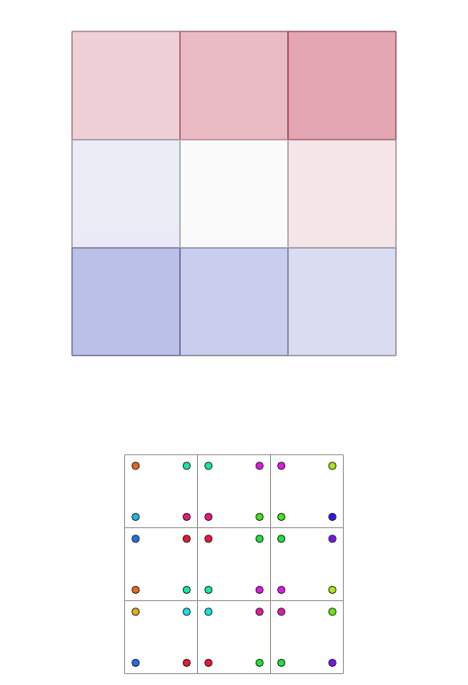
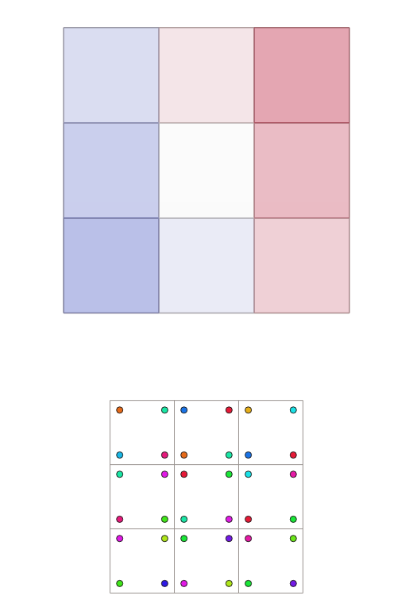

# Motivation

## Block Structure Tokens

```{=html}
<figure style="margin:0; text-align:center; font-family:'IBM Plex Mono',monospace;">
<div style="display:flex; justify-content:center; gap:1rem; width:100%;">

  <div style="flex:1; border-radius:10px; padding:1.4rem 1.2rem; background:#cfe6ef; color:#0a2f3d;">
    <div style="font-size:0.85rem; font-weight:700; letter-spacing:0.03em; margin-bottom:0.6rem;">THE PROBLEM</div>
    <div style="font-size:2.2rem; font-weight:700; margin-bottom:0.6rem;">12,608<br/><span style="font-size:1.1rem; font-weight:600;">tokens</span></div>
    <div style="font-size:0.95rem; line-height:1.4;">A single 2D test case already needs 1,576 faces at 8 tokens each, pushing attention memory over 30GB for a modest transformer.</div>
  </div>

  <div style="flex:1; border-radius:10px; padding:1.4rem 1.2rem; background:#6fb3ca; color:#0a2f3d;">
    <div style="font-size:0.85rem; font-weight:700; letter-spacing:0.03em; margin-bottom:0.6rem;">LEVEL 1 — HOW WE REDUCE IT</div>
    <div style="font-size:2.2rem; font-weight:700; margin-bottom:0.6rem;">1,584<br/><span style="font-size:1.1rem; font-weight:600;">tokens</span></div>
    <div style="font-size:0.95rem; line-height:1.4;">A coarse block structure, refined by transfinite interpolation, cuts tokens by 87.4% and attention memory drops to 482 MB.</div>
  </div>

  <div style="flex:1; border-radius:10px; padding:1.4rem 1.2rem; background:#0f4a63; color:#f3f2f2;">
    <div style="font-size:0.85rem; font-weight:700; letter-spacing:0.03em; margin-bottom:0.6rem;">LEVEL 2 — WHAT WE GENERATE</div>
    <div style="font-size:2.2rem; font-weight:700; margin-bottom:0.6rem;">1,022<br/><span style="font-size:1.1rem; font-weight:600;">tokens</span></div>
    <div style="font-size:0.95rem; line-height:1.4;">Row-structured ordering removes duplicate tokens, cutting a further 35.5% (up to &lt;50%) while attention memory drops to 201 MB.</div>
  </div>

</div>

<div style="display:flex; justify-content:center; align-items:center; gap:1.5rem; width:100%; margin-top:1rem;">
  
  <div style="font-size:2.6rem; font-weight:700; color:#0f4a63;">&harr;</div>
  
</div>

</figure>
```

::: {.notes}
The problem: even a small 2D test case, 1,576 faces, needs 12,608 tokens if you tokenize every face — already too long to generate autoregressively. Level 1 cuts that to 1,584 tokens by generating only the coarse block structure, refined afterward by transfinite interpolation — a 87.4% reduction, geometry-dependent. Level 2 cuts it further to 1,022 tokens: the row-structured ordering removes duplicate tokens, a further 35.5% reduction that holds regardless of geometry. Two independent levers, both attacking sequence length.
:::

# Introduction

## Why Order Matters

::: {.columns}
::: {.column width="46%"}
Attention computes vector products — a finite vocabulary is required.

1. Coordinates are quantized to 256 discrete levels, each level a token
2. Generation is autoregressive → a sequence order must be fixed, and
   each token's position is embedded too (positional encoding)

The mesh itself has no order — the tokenizer creates one.
:::
::: {.column width="54%"}
```{=html}
<div style="display:flex; justify-content:center; gap:1rem; align-items:center;">
  <div style="text-align:center;">
    
    <div style="font-size:0.8rem; color:#6b6663; margin-top:0.3rem;">row-major</div>
  </div>
  <div style="text-align:center;">
    
    <div style="font-size:0.8rem; color:#6b6663; margin-top:0.3rem;">column-major</div>
  </div>
</div>
<div style="text-align:center; margin-top:0.8rem; font-size:1.1rem; color:#d6006c; font-weight:600;">
  Same mesh, different order &rarr; different sequence
</div>
```
:::
:::

::: {.notes}
Transformers compute attention via vector dot products, so every input must be a vector from a finite vocabulary — continuous coordinates get quantized to 256 discrete levels, each level a token. Generation is autoregressive, so we must fix an order in which tokens appear, and that position is itself embedded (positional encoding). The key insight: the mesh itself has no order, only a set of vertices and faces. The tokenizer creates one. Same 3x3 grid, two different face traversals, colored by order (blue=first, red=last) — completely different color pattern, completely different token sequence, for the identical mesh. That's why the ordering strategy is the whole talk.
:::


# Tokenization

## Lexicographic Tokenization {.title-s}

::: {.columns}
::: {.column width="42%"}
**2-Step Sort**

::: {.incremental}
- Face order: each face's smallest $(y,x)$ vertex → sort faces by that
  - ideal mesh → faces fall into layers; more chaotic mesh → less true
- Vertex order: same $(y,x)$ sort within each face
  - ideal mesh → LL, LR, UL, UR — not a boundary walk → **can self-intersect**
- Shared vertices retokenized every face → no fixed repeat pattern
:::
:::
::: {.column width="58%"}
```{=html}
<div style="display:flex; justify-content:center;">
  <iframe src="embeds/tokenization_strat0.html" style="width:900px; max-width:100%; height:676px; border:2px solid #9a9490; border-radius:6px;" scrolling="no" frameborder="0"></iframe>
</div>
```
:::
:::

::: {.notes}
Uniform 3x3 grid, 4 faces animated step by step via the real lexicographic ordering. Row by row, x ascending. Watch the token bar fill: each vertex re-appears on the next face, so tokens repeat unpredictably within a row.
:::

## Conventional Method: Lexicographic Ordering {.title-s}

::: {.columns}
::: {.column width="48%"}

**The Problem — no structure to exploit**

- Order jumps across the mesh
  - face-order color scatters — mesh neighbours end up far apart in the sequence
- Every vertex re-tokenized per face
  - no compression possible — duplicates land at unpredictable positions
:::

::: {.column width="48%"}

```{=html}
<div style="display:flex;flex-direction:column;align-items:center;gap:0.5rem;">
  
  
</div>
```

:::
:::

## Adjacency-Preserving Tokenization {.title-s}

::: {.columns}
::: {.column width="42%"}
**Half-edge traversal — chain faces across shared edges**

::: {.incremental}
1. Start from lexicographically first face
2. Traverse in ascending $x$ while adjacent face exists → same **row**
3. No adjacent face left → jump to next unvisited face → new **row**
4. Exit edge of face $i$ = entrance edge of face $i+1$, reversed →
   **predictable** duplicates
5. Predictable duplicates (hatched) can be pruned; row-start entrance
   corners can't
6. **(EOR)** token marks row ends for decoding
:::
:::
::: {.column width="58%"}
```{=html}
<div style="display:flex; justify-content:center;">
  <iframe src="embeds/tokenization_strat3.html" style="width:900px; max-width:100%; height:676px; border:2px solid #9a9490; border-radius:6px;" scrolling="no" frameborder="0"></iframe>
</div>
```
:::
:::

::: {.notes}
Same grid, same 4 faces, half-edge traversal instead. Face order is identical to strategy 0 on a uniform grid — the difference shows in the per-face vertex order and the token bar: shared-edge vertices repeat in predictable positions.
:::

## Our Solution


::: {.columns}
::: {.column width="42%"}
**Half-edge traversal** — chain faces sharing edges

- Vertices ordered clockwise from bottom-left corner within each face.
- **Result:** last 2 vertices of face $i$ = first 2 of face $i+1$
  - discontinuities only between rows, not within faces
  - **predictable** repeated token positions
  - duplicated vertices within each row can be avoided by adding an end of row token
:::
::: {.column width="58%"}
```{=html}
<div style="display:flex;flex-direction:column;align-items:center;gap:0.5rem;">
  
  
</div>
```
:::
:::

::: {.notes}
Our adjacency-preserving ordering uses a half-edge data structure to traverse faces by edge connectivity rather than vertex coordinates. Starting from the lexicographically first face, we chain faces in ascending x until no adjacent face exists — that's one row. The next row starts from the first unvisited face. All rows run left-to-right. The key geometric property: the exit edge of face i becomes the entrance edge of face i+1 in reversed order — so the last two vertices of face i are identical (in reverse) to the first two of face i+1. Repeated token positions are now completely predictable. Toggle between mesh view and sequence view to see the difference.
:::

# Benchmark

## Transformer Architecture

::: {.columns}
::: {.column width="58%"}

**Geometric conditioning:**

- **Point Perceiver Encoder** — input point cloud (Delaunay triangulation) → fixed set of latent embeddings
- **Face Count Encoder** — sinusoidal encoding of desired face count → density control

**Positional encoding:**

- **RoPE** (Rotary Positional Embeddings) — encodes relative positions directly in attention; extrapolates to unseen sequence lengths

**Parameters** optimized via **Optuna** (3-stage HPO).

- $n$ stages, each: $m$ masked self-attention layers + 1 cross-attention


:::
::: {.column width="42%"}
```{=html}
<figure style="margin:0.3em 0;text-align:center;">
<svg viewBox="0 0 480 640" role="img" aria-label="Transformer architecture, top-to-bottom: token sequence flows through n repeated stages of masked self-attention and cross-attention, conditioned by a Point Perceiver encoder and Face Count encoder"
     style="width:100%;max-width:440px;height:auto;overflow:visible;font-family:'IBM Plex Mono',monospace;">
<defs>
<marker id="aa" viewBox="0 0 10 10" refX="8" refY="5" markerWidth="6" markerHeight="6" orient="auto-start-reverse"><path d="M0,0 L10,5 L0,10 z" fill="#201e1d"/></marker>
<marker id="ab" viewBox="0 0 10 10" refX="8" refY="5" markerWidth="6" markerHeight="6" orient="auto-start-reverse"><path d="M0,0 L10,5 L0,10 z" fill="#006786"/></marker>
</defs>

<!-- Main flow (left): Token Sequence -> n STAGES (Masked Self-Attn -> Cross-Attention) -> Softmax -->
<rect x="30" y="20" width="240" height="58" rx="8" fill="#eae9e9" stroke="#9a9490" stroke-width="1.5"/>
<text x="150" y="44" text-anchor="middle" style="fill:#201e1d;font-size:15px;font-weight:600;">Token Sequence</text>
<text x="150" y="62" text-anchor="middle" style="fill:#6b6663;font-size:11px;">x₁ … xₜ (causal)</text>

<line x1="150" y1="78" x2="150" y2="118" stroke="#201e1d" stroke-width="2" marker-end="url(#aa)"/>

<rect x="15" y="122" width="270" height="290" rx="10" fill="#f3f2f2" stroke="#d6006c" stroke-width="2.5"/>
<text x="150" y="150" text-anchor="middle" style="fill:#d6006c;font-size:14px;font-weight:700;letter-spacing:0.08em;">n STAGES</text>

<rect x="35" y="168" width="230" height="82" rx="6" fill="#fce8f1" stroke="#d6006c" stroke-width="1.5"/>
<text x="150" y="202" text-anchor="middle" style="fill:#201e1d;font-size:13px;font-weight:600;">m × Masked Self-Attn</text>
<text x="150" y="220" text-anchor="middle" style="fill:#6b6663;font-size:11px;">+ RoPE · causal</text>

<line x1="150" y1="250" x2="150" y2="278" stroke="#201e1d" stroke-width="1.5" marker-end="url(#aa)"/>

<rect x="35" y="280" width="230" height="82" rx="6" fill="#e8f4ed" stroke="#006786" stroke-width="1.5"/>
<text x="150" y="313" text-anchor="middle" style="fill:#201e1d;font-size:13px;font-weight:600;">Cross-Attention</text>
<text x="150" y="331" text-anchor="middle" style="fill:#6b6663;font-size:11px;">Q=tokens · K,V=context</text>

<line x1="295" y1="122" x2="295" y2="412" stroke="#d6006c" stroke-width="1.5"/>
<text x="308" y="267" text-anchor="start" transform="rotate(90 308 267)" style="fill:#d6006c;font-size:12px;">repeat n times</text>

<line x1="150" y1="412" x2="150" y2="442" stroke="#201e1d" stroke-width="2" marker-end="url(#aa)"/>
<rect x="35" y="444" width="230" height="58" rx="6" fill="#eae9e9" stroke="#9a9490" stroke-width="1.5"/>
<text x="150" y="478" text-anchor="middle" style="fill:#201e1d;font-size:13px;font-weight:600;">Softmax → next token</text>

<!-- Conditioning branch (right, own top-to-bottom flow): Point Cloud + Face Count -> encoders -> concat -> K,V context, injected sideways into Cross-Attention -->
<rect x="320" y="20" width="70" height="54" rx="6" fill="#eae9e9" stroke="#9a9490" stroke-width="1.5"/>
<text x="355" y="42" text-anchor="middle" style="fill:#201e1d;font-size:9.5px;font-weight:600;">Point Cloud</text>
<text x="355" y="57" text-anchor="middle" style="fill:#6b6663;font-size:7.5px;">Delaunay tri.</text>

<rect x="400" y="20" width="70" height="54" rx="6" fill="#eae9e9" stroke="#9a9490" stroke-width="1.5"/>
<text x="435" y="42" text-anchor="middle" style="fill:#201e1d;font-size:9.5px;font-weight:600;">Face Count</text>
<text x="435" y="57" text-anchor="middle" style="fill:#6b6663;font-size:7.5px;">desired # faces</text>

<line x1="355" y1="74" x2="355" y2="98" stroke="#201e1d" stroke-width="1.5" marker-end="url(#aa)"/>
<line x1="435" y1="74" x2="435" y2="98" stroke="#201e1d" stroke-width="1.5" marker-end="url(#aa)"/>

<rect x="320" y="100" width="70" height="72" rx="6" fill="#e0f2f8" stroke="#0088b0" stroke-width="1.5"/>
<text x="355" y="130" text-anchor="middle" style="fill:#201e1d;font-size:8.5px;font-weight:600;">Point Perceiver</text>
<text x="355" y="145" text-anchor="middle" style="fill:#0088b0;font-size:8.5px;">Encoder</text>

<rect x="400" y="100" width="70" height="72" rx="6" fill="#e0f2f8" stroke="#0088b0" stroke-width="1.5"/>
<text x="435" y="130" text-anchor="middle" style="fill:#201e1d;font-size:8.5px;font-weight:600;">Sinusoidal</text>
<text x="435" y="145" text-anchor="middle" style="fill:#0088b0;font-size:8.5px;">Encoder</text>

<line x1="355" y1="172" x2="392" y2="292" stroke="#006786" stroke-width="1.5" marker-end="url(#ab)"/>
<line x1="435" y1="172" x2="408" y2="292" stroke="#006786" stroke-width="1.5" marker-end="url(#ab)"/>
<text x="400" y="235" text-anchor="middle" style="fill:#006786;font-size:11px;font-weight:600;">concat</text>

<rect x="345" y="292" width="110" height="58" rx="8" fill="#e8f4ed" stroke="#006786" stroke-width="2"/>
<text x="400" y="326" text-anchor="middle" style="fill:#006786;font-size:12.5px;font-weight:600;">K, V context</text>

<line x1="345" y1="321" x2="269" y2="321" stroke="#006786" stroke-width="2" marker-end="url(#ab)"/>
</svg>
</figure>
```
:::
:::

## Data: Domain Partition

::: {.columns}
::: {.column width="48%"}
**Dataset:** 2000 turbine blade profiles

- Random **naca** profil
  - Random scale factor: 0.50 – 0.95
  - Random rotation: −π/4 to +π/4
- **Domain partition pipeline:**
  - Boundary crosses from local normals & tangents
  - Frame field propagation to interior
  - Singularity detection via **Poincaré index**
  - Streamlines from singularities along cross-field

- **Restriction:** meshes with 6 faces only

- **Data Augmentation**

:::
::: {.column width="52%"}
::: {.r-stack}
```{=html}
<figure style="text-align:center;margin:0.3em 0;">
<div style="display:flex;flex-direction:column;gap:0.35rem;align-items:center;">
  <div style="text-align:center;display:flex;align-items:center;gap:0.7rem;">
    
    <div style="font-size:0.7rem;color:#6b6663;font-family:'IBM Plex Mono',monospace;">Streamlines · 6 blocks</div>
  </div>
  <div style="text-align:center;display:flex;align-items:center;gap:0.7rem;">
    
    <div style="font-size:0.7rem;color:#6b6663;font-family:'IBM Plex Mono',monospace;">1× subdiv · 4 blocks</div>
  </div>
  <div style="text-align:center;display:flex;align-items:center;gap:0.7rem;">
    
    <div style="font-size:0.7rem;color:#6b6663;font-family:'IBM Plex Mono',monospace;">2× subdiv · 9 blocks</div>
  </div>
</div>
</figure>
```
:::
:::
:::


## Results: Tokenization Comparison

::: {.columns}
::: {.column width="55%"}

- Optuna-optimized configs 
  - 3 stage optimization 
  - 2 independent HPO runs each Method
  - Same seeds for each Method

| Strategy | BPT | Tokens | GPU | BPM | Acc. |
|---|---|---|---|---|---|
| Lexicographic | 0.388 | 448 | 15 866 MiB | 173.8 | 76.4% |
| **Adj.-Pres.** | **0.340** | 448 | 15 866 MiB | 152.3 | **79.0%** |
| **Sparse** | 0.551 | **272** | **8 379 MiB** | **149.9** | 68.3% |

**BPM** = BPT × tokens/mesh — holistic efficiency metric.

- **Adjacency-preserving:** best per-token prediction quality (+12.4% accuracy vs lex)
- **Sparse:** best overall efficiency (BPM 149.9) + 52.8% less GPU memory


:::
::: {.column width="45%"}

{height="380"}
:::
:::

::: {.notes}
The final comparison table tells two stories. Adjacency-preserving is the winner on per-token quality: BPT 0.340 vs 0.388 for lexicographic, accuracy 79% vs 76.4%. The structural coherence pays off directly. Sparse Row-Structured has higher per-token BPT — shorter sequences are harder to predict per token — but because sequences are 39% shorter, bits-per-mesh drops to 149.9, the lowest of all three. Combined with 52.8% GPU memory reduction (quadratic attention), Sparse enables training on much cheaper hardware and will scale better to larger meshes.
:::

# Outlook

## From CFD Mesh to Block Structures

```{=html}
<figure style="margin:0; text-align:center; font-family:'IBM Plex Mono',monospace;">

<!-- Row 1: Images (same height) -->
<div style="display:flex; justify-content:center; gap:1.5rem; width:100%;">
  <div style="flex:1;">
    <iframe src="embeds/tistos_2d.html" style="width:100%; height:400px; border:2px solid #9a9490; border-radius:6px;" scrolling="no" frameborder="0"></iframe>
  </div>
  <div style="flex:1;">
    <div style="border:2px solid #0088b0; border-radius:6px; padding:3px; background:#e0f2f8; height:400px; display:flex; align-items:center; justify-content:center;">
      
    </div>
  </div>
  <div style="flex:1;">
    <div style="border:2px solid #006786; border-radius:6px; padding:3px; background:#e8f4ed; height:400px; display:flex; align-items:center; justify-content:center;">
      
    </div>
  </div>
</div>

<!-- Row 2: Titles (same height, same font size) -->
<div style="display:flex; justify-content:center; gap:1.5rem; width:100%; margin-top:0.3rem;">
  <div style="flex:1; color:#201e1d; font-size:1.2rem; font-weight:600;">3D Turbine</div>
  <div style="flex:1; color:#0088b0; font-size:1.2rem; font-weight:600;">2D Hub</div>
  <div style="flex:1; color:#006786; font-size:1.2rem; font-weight:600;">2D Shroud</div>
</div>

<!-- Row 3: Descriptions in boxes matching panel widths -->
<div style="display:flex; justify-content:center; gap:1.5rem; width:100%; margin-top:0.8em;">
  <div style="flex:1; border:2px solid #d6006c; border-radius:6px; padding:3px; background:#fce8f1; text-align:center; font-size:1.05rem; color:#d6006c;">10<sup>6+</sup> elements &rarr; 4M tokens &rarr; infeasible</div>
  <div style="flex:2; border:2px solid #0088b0; border-radius:6px; padding:3px; background:#e0f2f8; text-align:center; font-size:1.05rem; color:#201e1d;">6 blocks &rarr; 6 hexa &rarr; 36 quads &rarr; <strong style="color:#0088b0;">304 tokens</strong></div>
</div>

</figure>
```

::: {.notes}
Work in progress: extending from 2D block structures to full 3D. Turbomachinery CFD requires high-quality structured meshes. A full 3D CFD mesh has millions of elements — direct vertex-wise tokenization yields ~4M tokens, infeasible for any autoregressive model. Our approach: unwrap the hub and shroud surfaces to 2D, generate coarse quad block structures (6 blocks per surface), then extrude back to 3D (6 hexa blocks, 36 quad face instances). Tokenizing these 36 quads yields only 304 tokens — a reduction of 4 orders of magnitude.
:::


