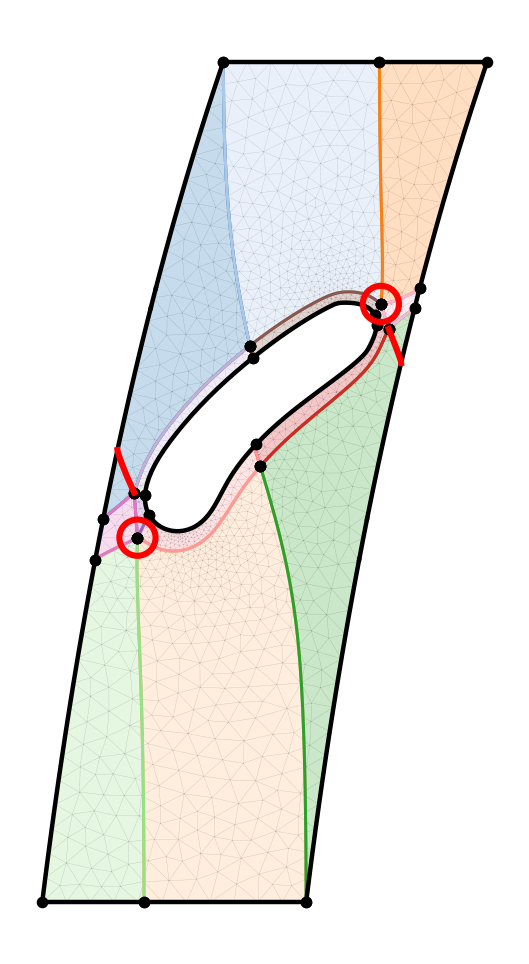
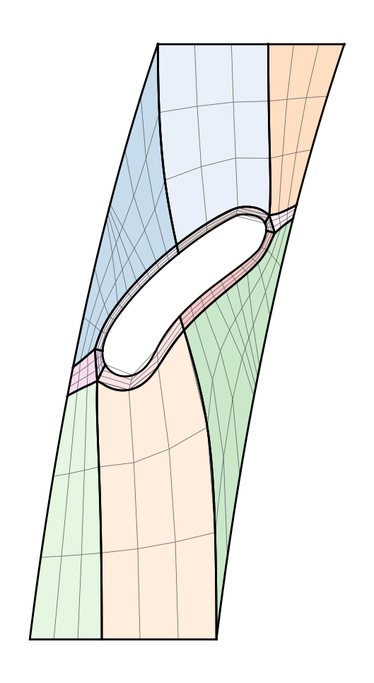

# Motivation

## From CFD Mesh to Block Structures

```{=html}
<figure style="margin:0; text-align:center; font-family:'IBM Plex Mono',monospace;">

<!-- Row 1: Images (same height) -->
<div style="display:flex; justify-content:center; gap:1.5rem; width:100%;">
  <div style="flex:1;">
    <iframe src="embeds/tistos_2d.html" style="width:100%; height:400px; border:2px solid #9a9490; border-radius:6px;" scrolling="no" frameborder="0"></iframe>
  </div>
  <div style="flex:1;">
    <div style="border:2px solid #0088b0; border-radius:6px; padding:3px; background:#e0f2f8; height:400px; display:flex; align-items:center; justify-content:center;">
      
    </div>
  </div>
  <div style="flex:1;">
    <div style="border:2px solid #006786; border-radius:6px; padding:3px; background:#e8f4ed; height:400px; display:flex; align-items:center; justify-content:center;">
      
    </div>
  </div>
</div>

<!-- Row 2: Titles (same height, same font size) -->
<div style="display:flex; justify-content:center; gap:1.5rem; width:100%; margin-top:0.3rem;">
  <div style="flex:1; color:#201e1d; font-size:1.2rem; font-weight:600;">3D Turbine</div>
  <div style="flex:1; color:#0088b0; font-size:1.2rem; font-weight:600;">2D Hub</div>
  <div style="flex:1; color:#006786; font-size:1.2rem; font-weight:600;">2D Shroud</div>
</div>

<!-- Row 3: Descriptions in boxes matching panel widths -->
<div style="display:flex; justify-content:center; gap:1.5rem; width:100%; margin-top:0.8em;">
  <div style="flex:1; border:2px solid #d6006c; border-radius:6px; padding:3px; background:#fce8f1; text-align:center; font-size:1.05rem; color:#d6006c;">10<sup>6+</sup> elements &rarr; 4M tokens &rarr; infeasible</div>
  <div style="flex:2; border:2px solid #0088b0; border-radius:6px; padding:3px; background:#e0f2f8; text-align:center; font-size:1.05rem; color:#201e1d;">6 blocks &rarr; 6 hexa &rarr; 36 quads &rarr; <strong style="color:#0088b0;">304 tokens</strong></div>
</div>

</figure>
```

::: {.notes}
Turbomachinery CFD requires high-quality structured meshes. A full 3D CFD mesh has millions of elements — direct vertex-wise tokenization yields ~4M tokens, infeasible for any autoregressive model. Our approach: unwrap the hub and shroud surfaces to 2D, generate coarse quad block structures (6 blocks per surface), then extrude back to 3D (6 hexa blocks, 36 quad face instances). Tokenizing these 36 quads yields only 304 tokens — a reduction of 4 orders of magnitude. The remaining challenge: the order in which tokens appear in the sequence determines whether the Transformer can learn the pattern at all.
:::

## Block Structure Tokens

```{=html}
<figure style="margin:0; text-align:center; display:flex; flex-direction:column; align-items:center; gap:0.4em;">
<div style="display:flex; align-items:center; justify-content:center; gap:1.5rem; width:100%;">

  <!-- Panel 1: 3D Axial Machine (Plotly iframe) -->
  <div style="text-align:center; flex:0 0 38%;">
    <iframe src="embeds/tistos_2d.html" style="width:100%; height:430px; border:none; border-radius:6px;" scrolling="no" frameborder="0"></iframe>
    <div style="font-family:'IBM Plex Mono',monospace; color:#201e1d; font-size:1.0rem; margin-top:0.3rem; font-weight:600;">3D Axial Machine</div>
    <div style="font-family:'IBM Plex Mono',monospace; color:#6b6663; font-size:0.85rem;">hub &amp; shroud flow channel</div>
  </div>

  <!-- Middle: Token numbers -->
  <div style="flex:0 0 24%; text-align:center; font-family:'IBM Plex Mono',monospace;">
    <div style="color:#d6006c; font-size:1.05rem; font-weight:600; margin-bottom:0.6em; line-height:1.6;">
      62K ref / 10<sup>6+</sup> prod<br/>elements
    </div>
    <div style="color:#d6006c; font-size:0.95rem; margin-bottom:0.4em; line-height:1.5;">
      ~250K / 4M<br/>vertex tokens<br/><strong>infeasible</strong>
    </div>
    <div style="border-top:1px solid #9a9490; margin:0.7em auto; width:70%;"></div>
    <div style="color:#0088b0; font-size:1.05rem; font-weight:600; margin-bottom:0.3em;">
      272 tokens
    </div>
    <div style="color:#0088b0; font-size:0.95rem; line-height:1.5;">
      900x / 15,000x<br/>reduction<br/><strong>feasible</strong>
    </div>
  </div>

  <!-- Panel 2: Block structure + TFI 3 (stacked) -->
  <div style="text-align:center; flex:0 0 38%; display:flex; flex-direction:column; align-items:center; gap:0.4rem;">
    <div style="text-align:center;">
      
      <div style="font-family:'IBM Plex Mono',monospace; color:#201e1d; font-size:0.85rem; font-weight:600;">Block structure</div>
    </div>
    <div style="text-align:center;">
      <div style="border:2px solid #006786; border-radius:6px; padding:3px; background:#e8f4ed;">
        
      </div>
      <div style="font-family:'IBM Plex Mono',monospace; color:#006786; font-size:0.85rem; font-weight:600;">TFI mesh</div>
    </div>
  </div>

</div>

<p style="font-family:'IBM Plex Mono',monospace; color:#201e1d; font-size:1.1rem; margin-top:0.3em;">
Tokenization <em style="color:#d6006c; font-weight:600;">order</em> determines whether the Transformer can learn the pattern.
</p>
</figure>
```

::: {.notes}
Turbomachinery CFD requires high-quality structured meshes. Today this is a manual, expert-driven process. Transformers could automate this, but a full CFD mesh has 62K elements in our reference case — and millions in production. Direct vertex-wise tokenization yields 250K to 4M tokens, which is infeasible for any autoregressive model. Our approach: generate only the coarse quad block structure — 272 tokens — then refine to full resolution via transfinite interpolation. That is a 900x reduction for the reference mesh, up to 15,000x for production CFD. The remaining challenge: the order in which tokens appear in the sequence determines whether the Transformer can learn the pattern at all.
:::

# Introduction 

## Mesh Generation as Classification

```{=html}
<figure style="margin:0;text-align:center;font-family:'IBM Plex Mono',monospace;">

<!-- ═══ Upper row: Quantize → Tokens → Embeddings (single SVG, no boxes) ═══ -->
<svg viewBox="0 0 1700 340" role="img" aria-label="Tokenization pipeline: normalized coordinates are quantized to 256 discrete tokens, arranged as a sequence of 8 tokens per quad face, then mapped to learned embedding vectors." style="width:100%;max-width:1650px;height:auto;overflow:visible;font-family:'IBM Plex Mono',monospace;">
<defs>
  <marker id="tk2-g" viewBox="0 0 10 10" refX="8" refY="5" markerWidth="8" markerHeight="8" orient="auto-start-reverse"><path d="M0,0 L10,5 L0,10 z" fill="#9a9490"/></marker>
  <marker id="tk2-b" viewBox="0 0 10 10" refX="8" refY="5" markerWidth="8" markerHeight="8" orient="auto-start-reverse"><path d="M0,0 L10,5 L0,10 z" fill="#0088b0"/></marker>
  <marker id="tk2-m" viewBox="0 0 10 10" refX="8" refY="5" markerWidth="8" markerHeight="8" orient="auto-start-reverse"><path d="M0,0 L10,5 L0,10 z" fill="#d6006c"/></marker>
</defs>

<!-- ── Quantize ── -->
<g transform="translate(10,30)">
  <text x="200" y="-8" text-anchor="middle" style="fill:#201e1d;font-size:18px;font-weight:600;">Quantize</text>

  <!-- formula -->
  <text x="200" y="30" text-anchor="middle" style="fill:#201e1d;font-size:16px;font-weight:600;">c_D = round(c_N × 255)</text>

  <!-- axis 0→255 -->
  <line x1="40" y1="70" x2="360" y2="70" stroke="#201e1d" stroke-width="2"/>
  <line x1="40" y1="63" x2="40" y2="77" stroke="#201e1d" stroke-width="1.5"/>
  <line x1="200" y1="63" x2="200" y2="77" stroke="#201e1d" stroke-width="1.5"/>
  <line x1="360" y1="63" x2="360" y2="77" stroke="#201e1d" stroke-width="1.5"/>
  <text x="40" y="92" text-anchor="middle" style="fill:#6b6663;font-size:13px;">0</text>
  <text x="200" y="92" text-anchor="middle" style="fill:#6b6663;font-size:13px;">127</text>
  <text x="360" y="92" text-anchor="middle" style="fill:#6b6663;font-size:13px;">255</text>

  <!-- discrete bins on axis -->
  <rect x="40"  y="60" width="35" height="10" fill="#0088b0" opacity="0.35"/>
  <rect x="75"  y="60" width="35" height="10" fill="#d6006c" opacity="0.35"/>
  <rect x="110" y="60" width="35" height="10" fill="#0088b0" opacity="0.35"/>
  <rect x="145" y="60" width="35" height="10" fill="#d6006c" opacity="0.35"/>
  <rect x="180" y="60" width="35" height="10" fill="#0088b0" opacity="0.35"/>
  <rect x="215" y="60" width="35" height="10" fill="#d6006c" opacity="0.35"/>
  <rect x="250" y="60" width="35" height="10" fill="#0088b0" opacity="0.35"/>
  <rect x="285" y="60" width="35" height="10" fill="#d6006c" opacity="0.35"/>
  <rect x="320" y="60" width="35" height="10" fill="#0088b0" opacity="0.35"/>

  <!-- result -->
  <text x="200" y="125" text-anchor="middle" style="fill:#0088b0;font-size:15px;font-weight:600;">→ {0, 1, 2, …, 255}</text>
  <text x="200" y="148" text-anchor="middle" style="fill:#6b6663;font-size:13px;">256 coordinate tokens</text>
  <text x="200" y="168" text-anchor="middle" style="fill:#6b6663;font-size:13px;">+ SOS · EOS · PAD</text>

  <!-- example values -->
  <text x="200" y="205" text-anchor="middle" style="fill:#6b6663;font-size:12px;">v₁ = (0.12, 0.85)</text>
  <text x="200" y="225" text-anchor="middle" style="fill:#0088b0;font-size:14px;font-weight:600;">→ (31, 217)</text>
</g>

<!-- arrow Quantize → Token Sequence -->
<line x1="430" y1="180" x2="510" y2="180" stroke="#0088b0" stroke-width="3" marker-end="url(#tk2-b)"/>

<!-- ── Token Sequence ── -->
<g transform="translate(520,30)">
  <text x="220" y="-8" text-anchor="middle" style="fill:#201e1d;font-size:18px;font-weight:600;">Token Sequence</text>

  <!-- SOS -->
  <rect x="0" y="20" width="34" height="34" fill="#201e1d" rx="5"/>
  <text x="17" y="42" text-anchor="middle" style="fill:#fff;font-size:12px;font-weight:600;">SOS</text>

  <!-- 8 tokens for one quad -->
  <rect x="42" y="20" width="34" height="34" fill="#0088b0" rx="5"/>
  <text x="59" y="42" text-anchor="middle" style="fill:#fff;font-size:13px;font-weight:600;">31</text>
  <rect x="80" y="20" width="34" height="34" fill="#d6006c" rx="5"/>
  <text x="97" y="42" text-anchor="middle" style="fill:#fff;font-size:13px;font-weight:600;">217</text>
  <rect x="118" y="20" width="34" height="34" fill="#0088b0" rx="5"/>
  <text x="135" y="42" text-anchor="middle" style="fill:#fff;font-size:13px;font-weight:600;">97</text>
  <rect x="156" y="20" width="34" height="34" fill="#d6006c" rx="5"/>
  <text x="173" y="42" text-anchor="middle" style="fill:#fff;font-size:13px;font-weight:600;">133</text>
  <rect x="194" y="20" width="34" height="34" fill="#0088b0" rx="5"/>
  <text x="211" y="42" text-anchor="middle" style="fill:#fff;font-size:13px;font-weight:600;">31</text>
  <rect x="232" y="20" width="34" height="34" fill="#d6006c" rx="5"/>
  <text x="249" y="42" text-anchor="middle" style="fill:#fff;font-size:13px;font-weight:600;">133</text>
  <rect x="270" y="20" width="34" height="34" fill="#0088b0" rx="5"/>
  <text x="287" y="42" text-anchor="middle" style="fill:#fff;font-size:13px;font-weight:600;">97</text>
  <rect x="308" y="20" width="34" height="34" fill="#d6006c" rx="5"/>
  <text x="325" y="42" text-anchor="middle" style="fill:#fff;font-size:13px;font-weight:600;">217</text>

  <!-- bracket: one quad = 8 tokens -->
  <path d="M 42 60 L 42 66 L 342 66 L 342 60" fill="none" stroke="#9a9490" stroke-width="1.5"/>
  <text x="192" y="84" text-anchor="middle" style="fill:#6b6663;font-size:13px;">8 tokens / quad — (x, y) × 4 verts</text>

  <!-- next quad -->
  <rect x="0" y="110" width="34" height="34" fill="#0088b0" rx="5"/>
  <text x="17" y="132" text-anchor="middle" style="fill:#fff;font-size:13px;font-weight:600;">…</text>
  <rect x="42" y="110" width="34" height="34" fill="#d6006c" rx="5"/>
  <text x="59" y="132" text-anchor="middle" style="fill:#fff;font-size:13px;font-weight:600;">…</text>
  <rect x="80" y="110" width="34" height="34" fill="#0088b0" rx="5"/>
  <text x="97" y="132" text-anchor="middle" style="fill:#fff;font-size:13px;font-weight:600;">…</text>
  <rect x="118" y="110" width="34" height="34" fill="#d6006c" rx="5"/>
  <text x="135" y="132" text-anchor="middle" style="fill:#fff;font-size:13px;font-weight:600;">…</text>
  <text x="170" y="132" style="fill:#6b6663;font-size:13px;">next quad</text>

  <!-- EOS -->
  <rect x="308" y="110" width="34" height="34" fill="#201e1d" rx="5"/>
  <text x="325" y="132" text-anchor="middle" style="fill:#fff;font-size:12px;font-weight:600;">EOS</text>

  <!-- annotation -->
  <text x="192" y="175" text-anchor="middle" style="fill:#d6006c;font-size:15px;font-weight:600;">order matters!</text>
  <text x="192" y="198" text-anchor="middle" style="fill:#6b6663;font-size:13px;">autoregressive: predict next token</text>
  <text x="192" y="218" text-anchor="middle" style="fill:#6b6663;font-size:13px;">given all previous tokens</text>
</g>

<!-- arrow Token Sequence → Embeddings -->
<line x1="880" y1="180" x2="960" y2="180" stroke="#d6006c" stroke-width="3" marker-end="url(#tk2-m)"/>

<!-- ── Embeddings ── -->
<g transform="translate(970,30)">
  <text x="200" y="-8" text-anchor="middle" style="fill:#201e1d;font-size:18px;font-weight:600;">Embeddings</text>

  <!-- embedding vectors (vertical bars) -->
  <rect x="30"  y="20" width="24" height="70" fill="#0088b0" opacity="0.6" rx="3"/>
  <rect x="60"  y="20" width="24" height="70" fill="#d6006c" opacity="0.6" rx="3"/>
  <rect x="90"  y="20" width="24" height="70" fill="#0088b0" opacity="0.6" rx="3"/>
  <rect x="120" y="20" width="24" height="70" fill="#d6006c" opacity="0.6" rx="3"/>
  <rect x="150" y="20" width="24" height="70" fill="#0088b0" opacity="0.6" rx="3"/>
  <rect x="180" y="20" width="24" height="70" fill="#d6006c" opacity="0.6" rx="3"/>
  <rect x="210" y="20" width="24" height="70" fill="#0088b0" opacity="0.6" rx="3"/>
  <rect x="240" y="20" width="24" height="70" fill="#d6006c" opacity="0.6" rx="3"/>
  <rect x="270" y="20" width="24" height="70" fill="#0088b0" opacity="0.6" rx="3"/>
  <rect x="300" y="20" width="24" height="70" fill="#d6006c" opacity="0.6" rx="3"/>

  <!-- arrows down -->
  <line x1="42"  y1="95" x2="42"  y2="112" stroke="#9a9490" stroke-width="1.5" marker-end="url(#tk2-g)"/>
  <line x1="72"  y1="95" x2="72"  y2="112" stroke="#9a9490" stroke-width="1.5" marker-end="url(#tk2-g)"/>
  <line x1="102" y1="95" x2="102" y2="112" stroke="#9a9490" stroke-width="1.5" marker-end="url(#tk2-g)"/>
  <line x1="132" y1="95" x2="132" y2="112" stroke="#9a9490" stroke-width="1.5" marker-end="url(#tk2-g)"/>
  <line x1="162" y1="95" x2="162" y2="112" stroke="#9a9490" stroke-width="1.5" marker-end="url(#tk2-g)"/>
  <line x1="192" y1="95" x2="192" y2="112" stroke="#9a9490" stroke-width="1.5" marker-end="url(#tk2-g)"/>
  <line x1="222" y1="95" x2="222" y2="112" stroke="#9a9490" stroke-width="1.5" marker-end="url(#tk2-g)"/>
  <line x1="252" y1="95" x2="252" y2="112" stroke="#9a9490" stroke-width="1.5" marker-end="url(#tk2-g)"/>
  <line x1="282" y1="95" x2="282" y2="112" stroke="#9a9490" stroke-width="1.5" marker-end="url(#tk2-g)"/>
  <line x1="312" y1="95" x2="312" y2="112" stroke="#9a9490" stroke-width="1.5" marker-end="url(#tk2-g)"/>

  <!-- token IDs -->
  <text x="42"  y="130" text-anchor="middle" style="fill:#201e1d;font-size:13px;">SOS</text>
  <text x="72"  y="130" text-anchor="middle" style="fill:#201e1d;font-size:13px;">31</text>
  <text x="102" y="130" text-anchor="middle" style="fill:#201e1d;font-size:13px;">217</text>
  <text x="132" y="130" text-anchor="middle" style="fill:#201e1d;font-size:13px;">97</text>
  <text x="162" y="130" text-anchor="middle" style="fill:#201e1d;font-size:13px;">133</text>
  <text x="192" y="130" text-anchor="middle" style="fill:#201e1d;font-size:13px;">31</text>
  <text x="222" y="130" text-anchor="middle" style="fill:#201e1d;font-size:13px;">133</text>
  <text x="252" y="130" text-anchor="middle" style="fill:#201e1d;font-size:13px;">97</text>
  <text x="282" y="130" text-anchor="middle" style="fill:#201e1d;font-size:13px;">217</text>
  <text x="312" y="130" text-anchor="middle" style="fill:#201e1d;font-size:13px;">…</text>

  <!-- annotations -->
  <text x="200" y="160" text-anchor="middle" style="fill:#6b6663;font-size:13px;">learned lookup table</text>
  <text x="200" y="180" text-anchor="middle" style="fill:#6b6663;font-size:13px;">token ID → dense vector</text>
  <text x="200" y="200" text-anchor="middle" style="fill:#6b6663;font-size:13px;">+ positional encoding</text>

  <!-- arrow to transformer -->
  <line x1="200" y1="215" x2="200" y2="245" stroke="#006786" stroke-width="3" marker-end="url(#tk2-b)"/>
  <text x="200" y="275" text-anchor="middle" style="fill:#006786;font-size:15px;font-weight:600;">Transformer</text>
  <text x="200" y="295" text-anchor="middle" style="fill:#006786;font-size:13px;">masked self-attention</text>
</g>

</svg>

<!-- ═══ Lower row: Example mesh + sequence (viz_s0) ═══ -->
<div style="display:flex; justify-content:center; gap:2rem; margin-top:1.2rem; width:100%;">
  <div style="flex:1; text-align:center;">
    <div style="border:2px solid #9a9490; border-radius:6px; padding:3px; background:#eae9e9; height:300px; display:flex; align-items:center; justify-content:center;">
      
    </div>
    <div style="color:#201e1d; font-size:1.1rem; font-weight:600; margin-top:0.3rem;">Mesh — face order</div>
    <div style="color:#d6006c; font-size:0.95rem;">lexicographic (y, x) sort</div>
  </div>
  <div style="flex:1; text-align:center;">
    <div style="border:2px solid #d6006c; border-radius:6px; padding:3px; background:#fce8f1; height:300px; display:flex; align-items:center; justify-content:center;">
      
    </div>
    <div style="color:#201e1d; font-size:1.1rem; font-weight:600; margin-top:0.3rem;">Sequence — first 12 faces</div>
    <div style="color:#d6006c; font-size:0.95rem;">jumps across the mesh</div>
  </div>
</div>

</figure>
```

::: {.notes}
Mesh generation as a classification problem. Upper row: vertex coordinates normalized to [0,1] are quantized to 256 discrete levels (c_D = round(c_N × 255)). Each quad face becomes 8 tokens (x,y for 4 vertices), delimited by SOS/EOS. Token IDs map to learned embedding vectors with positional encoding, then fed to a transformer with masked self-attention. Order matters — the transformer predicts the next token autoregressively. Lower row: a concrete example using lexicographic (y,x) ordering. The mesh shows face ordering color-coded; the sequence shows the first 12 faces. Notice how the sequence jumps across the mesh — adjacent faces in 3D are far apart in token space. This is the problem we address.
:::


## Mesh Generation as Classification (Detail)


```{=html}
<figure style="margin:0;text-align:center;font-family:'IBM Plex Mono',monospace;">
<svg viewBox="0 0 1800 480" role="img" aria-label="Mesh generation as classification: quad mesh vertices are normalized, quantized to discrete tokens, embedded, and fed to a transformer that autoregressively predicts the next vertex." style="width:100%;max-width:1700px;height:auto;overflow:visible;font-family:'IBM Plex Mono',monospace;">
<defs>
  <marker id="tk-g" viewBox="0 0 10 10" refX="8" refY="5" markerWidth="7" markerHeight="7" orient="auto-start-reverse"><path d="M0,0 L10,5 L0,10 z" fill="#9a9490"/></marker>
  <marker id="tk-b" viewBox="0 0 10 10" refX="8" refY="5" markerWidth="7" markerHeight="7" orient="auto-start-reverse"><path d="M0,0 L10,5 L0,10 z" fill="#0088b0"/></marker>
  <marker id="tk-m" viewBox="0 0 10 10" refX="8" refY="5" markerWidth="7" markerHeight="7" orient="auto-start-reverse"><path d="M0,0 L10,5 L0,10 z" fill="#d6006c"/></marker>
</defs>

<!-- ── Step 1: Quad Mesh ── -->
<g transform="translate(20,40)">
  <text x="130" y="-12" text-anchor="middle" style="fill:#201e1d;font-size:17px;font-weight:600;">1 · Quad Mesh</text>
  <rect x="30" y="5" width="200" height="200" fill="#eae9e9" stroke="#9a9490" stroke-width="2" rx="8"/>
  <!-- grid lines -->
  <line x1="30" y1="70" x2="230" y2="70" stroke="#9a9490" stroke-width="1"/>
  <line x1="30" y1="135" x2="230" y2="135" stroke="#9a9490" stroke-width="1"/>
  <line x1="96" y1="5" x2="96" y2="205" stroke="#9a9490" stroke-width="1"/>
  <line x1="163" y1="5" x2="163" y2="205" stroke="#9a9490" stroke-width="1"/>
  <!-- vertices -->
  <circle cx="30" cy="5" r="5" fill="#0088b0"/>
  <circle cx="96" cy="5" r="5" fill="#d6006c"/>
  <circle cx="163" cy="5" r="5" fill="#0088b0"/>
  <circle cx="230" cy="5" r="5" fill="#d6006c"/>
  <circle cx="30" cy="70" r="5" fill="#d6006c"/>
  <circle cx="96" cy="70" r="5" fill="#0088b0"/>
  <circle cx="163" cy="70" r="5" fill="#d6006c"/>
  <circle cx="230" cy="70" r="5" fill="#0088b0"/>
  <circle cx="30" cy="135" r="5" fill="#0088b0"/>
  <circle cx="96" cy="135" r="5" fill="#d6006c"/>
  <circle cx="163" cy="135" r="5" fill="#0088b0"/>
  <circle cx="230" cy="135" r="5" fill="#d6006c"/>
  <circle cx="30" cy="205" r="5" fill="#d6006c"/>
  <circle cx="96" cy="205" r="5" fill="#0088b0"/>
  <circle cx="163" cy="205" r="5" fill="#d6006c"/>
  <circle cx="230" cy="205" r="5" fill="#0088b0"/>
  <!-- one quad highlighted -->
  <rect x="30" y="5" width="66" height="65" fill="none" stroke="#d6006c" stroke-width="3" rx="2"/>
  <text x="130" y="230" text-anchor="middle" style="fill:#6b6663;font-size:13px;">4 verts / face</text>
</g>

<!-- arrow 1→2 -->
<line x1="270" y1="140" x2="320" y2="140" stroke="#9a9490" stroke-width="2.5" marker-end="url(#tk-g)"/>

<!-- ── Step 2: Vertices ── -->
<g transform="translate(330,40)">
  <text x="100" y="-12" text-anchor="middle" style="fill:#201e1d;font-size:17px;font-weight:600;">2 · Vertices</text>
  <rect x="0" y="5" width="200" height="200" fill="#f3f2f2" stroke="#9a9490" stroke-width="2" rx="8"/>
  <text x="15" y="35" style="fill:#0088b0;font-size:14px;">v₁ = (0.12, 0.85)</text>
  <text x="15" y="60" style="fill:#d6006c;font-size:14px;">v₂ = (0.38, 0.85)</text>
  <text x="15" y="85" style="fill:#0088b0;font-size:14px;">v₃ = (0.38, 0.52)</text>
  <text x="15" y="110" style="fill:#d6006c;font-size:14px;">v₄ = (0.12, 0.52)</text>
  <line x1="10" y1="125" x2="190" y2="125" stroke="#9a9490" stroke-width="1" stroke-dasharray="4 4"/>
  <text x="15" y="150" style="fill:#6b6663;font-size:12px;">normalized to [0,1]</text>
  <text x="15" y="175" style="fill:#6b6663;font-size:12px;">scale-invariant</text>
  <text x="15" y="200" style="fill:#6b6663;font-size:12px;">translation-invariant</text>
</g>

<!-- arrow 2→3 -->
<line x1="540" y1="140" x2="590" y2="140" stroke="#9a9490" stroke-width="2.5" marker-end="url(#tk-g)"/>

<!-- ── Step 3: Quantize ── -->
<g transform="translate(600,40)">
  <text x="110" y="-12" text-anchor="middle" style="fill:#201e1d;font-size:17px;font-weight:600;">3 · Quantize</text>
  <rect x="0" y="5" width="220" height="200" fill="#e0f2f8" stroke="#0088b0" stroke-width="2" rx="8"/>
  <!-- formula -->
  <text x="110" y="40" text-anchor="middle" style="fill:#201e1d;font-size:15px;font-weight:600;">c_D = round(c_N × 255)</text>
  <!-- axis -->
  <line x1="20" y1="80" x2="200" y2="80" stroke="#201e1d" stroke-width="2"/>
  <text x="20" y="100" text-anchor="middle" style="fill:#6b6663;font-size:12px;">0</text>
  <text x="110" y="100" text-anchor="middle" style="fill:#6b6663;font-size:12px;">127</text>
  <text x="200" y="100" text-anchor="middle" style="fill:#6b6663;font-size:12px;">255</text>
  <!-- tick marks -->
  <line x1="20" y1="75" x2="20" y2="85" stroke="#201e1d" stroke-width="1.5"/>
  <line x1="110" y1="75" x2="110" y2="85" stroke="#201e1d" stroke-width="1.5"/>
  <line x1="200" y1="75" x2="200" y2="85" stroke="#201e1d" stroke-width="1.5"/>
  <!-- discrete bins -->
  <rect x="20" y="70" width="20" height="10" fill="#0088b0" opacity="0.4"/>
  <rect x="40" y="70" width="20" height="10" fill="#d6006c" opacity="0.4"/>
  <rect x="60" y="70" width="20" height="10" fill="#0088b0" opacity="0.4"/>
  <rect x="80" y="70" width="20" height="10" fill="#d6006c" opacity="0.4"/>
  <rect x="100" y="70" width="20" height="10" fill="#0088b0" opacity="0.4"/>
  <rect x="120" y="70" width="20" height="10" fill="#d6006c" opacity="0.4"/>
  <rect x="140" y="70" width="20" height="10" fill="#0088b0" opacity="0.4"/>
  <rect x="160" y="70" width="20" height="10" fill="#d6006c" opacity="0.4"/>
  <rect x="180" y="70" width="20" height="10" fill="#0088b0" opacity="0.4"/>
  <!-- result -->
  <text x="110" y="140" text-anchor="middle" style="fill:#0088b0;font-size:14px;font-weight:600;">→ {0, 1, 2, …, 255}</text>
  <text x="110" y="165" text-anchor="middle" style="fill:#6b6663;font-size:12px;">256 coordinate tokens</text>
  <text x="110" y="185" text-anchor="middle" style="fill:#6b6663;font-size:12px;">+ SOS · EOS · PAD</text>
</g>

<!-- arrow 3→4 -->
<line x1="830" y1="140" x2="880" y2="140" stroke="#0088b0" stroke-width="2.5" marker-end="url(#tk-b)"/>

<!-- ── Step 4: Token Sequence ── -->
<g transform="translate(890,40)">
  <text x="120" y="-12" text-anchor="middle" style="fill:#201e1d;font-size:17px;font-weight:600;">4 · Token Sequence</text>
  <rect x="0" y="5" width="240" height="200" fill="#fce8f1" stroke="#d6006c" stroke-width="2" rx="8"/>
  <!-- SOS -->
  <rect x="15" y="30" width="28" height="28" fill="#201e1d" rx="4"/>
  <text x="29" y="49" text-anchor="middle" style="fill:#fff;font-size:11px;font-weight:600;">SOS</text>
  <!-- 8 tokens for quad -->
  <rect x="50" y="30" width="28" height="28" fill="#0088b0" rx="4"/>
  <text x="64" y="49" text-anchor="middle" style="fill:#fff;font-size:12px;font-weight:600;">31</text>
  <rect x="82" y="30" width="28" height="28" fill="#d6006c" rx="4"/>
  <text x="96" y="49" text-anchor="middle" style="fill:#fff;font-size:12px;font-weight:600;">97</text>
  <rect x="114" y="30" width="28" height="28" fill="#0088b0" rx="4"/>
  <text x="128" y="49" text-anchor="middle" style="fill:#fff;font-size:12px;font-weight:600;">97</text>
  <rect x="146" y="30" width="28" height="28" fill="#d6006c" rx="4"/>
  <text x="160" y="49" text-anchor="middle" style="fill:#fff;font-size:12px;font-weight:600;">217</text>
  <rect x="178" y="30" width="28" height="28" fill="#0088b0" rx="4"/>
  <text x="192" y="49" text-anchor="middle" style="fill:#fff;font-size:12px;font-weight:600;">31</text>
  <rect x="210" y="30" width="28" height="28" fill="#d6006c" rx="4"/>
  <text x="224" y="49" text-anchor="middle" style="fill:#fff;font-size:10px;font-weight:600;">…</text>
  <!-- bracket -->
  <path d="M 50 65 L 50 70 L 238 70 L 238 65" fill="none" stroke="#9a9490" stroke-width="1.5"/>
  <text x="144" y="88" text-anchor="middle" style="fill:#6b6663;font-size:12px;">8 tokens / quad (x,y × 4 verts)</text>
  <!-- next quad -->
  <rect x="15" y="105" width="28" height="28" fill="#0088b0" rx="4"/>
  <text x="29" y="124" text-anchor="middle" style="fill:#fff;font-size:12px;font-weight:600;">…</text>
  <rect x="50" y="105" width="28" height="28" fill="#d6006c" rx="4"/>
  <text x="64" y="124" text-anchor="middle" style="fill:#fff;font-size:12px;font-weight:600;">…</text>
  <text x="90" y="124" style="fill:#6b6663;font-size:12px;">next quad</text>
  <!-- EOS -->
  <rect x="190" y="105" width="28" height="28" fill="#201e1d" rx="4"/>
  <text x="204" y="124" text-anchor="middle" style="fill:#fff;font-size:11px;font-weight:600;">EOS</text>
  <!-- annotation -->
  <text x="120" y="160" text-anchor="middle" style="fill:#d6006c;font-size:13px;font-weight:600;">order matters!</text>
  <text x="120" y="180" text-anchor="middle" style="fill:#6b6663;font-size:12px;">autoregressive: predict next token</text>
  <text x="120" y="198" text-anchor="middle" style="fill:#6b6663;font-size:12px;">given all previous tokens</text>
</g>

<!-- arrow 4→5 -->
<line x1="1140" y1="140" x2="1190" y2="140" stroke="#d6006c" stroke-width="2.5" marker-end="url(#tk-m)"/>

<!-- ── Step 5: Embeddings ── -->
<g transform="translate(1200,40)">
  <text x="90" y="-12" text-anchor="middle" style="fill:#201e1d;font-size:17px;font-weight:600;">5 · Embeddings</text>
  <rect x="0" y="5" width="180" height="200" fill="#f3f2f2" stroke="#9a9490" stroke-width="2" rx="8"/>
  <!-- embedding vectors -->
  <rect x="20" y="30" width="20" height="60" fill="#0088b0" opacity="0.6" rx="2"/>
  <rect x="44" y="30" width="20" height="60" fill="#d6006c" opacity="0.6" rx="2"/>
  <rect x="68" y="30" width="20" height="60" fill="#0088b0" opacity="0.6" rx="2"/>
  <rect x="92" y="30" width="20" height="60" fill="#d6006c" opacity="0.6" rx="2"/>
  <rect x="116" y="30" width="20" height="60" fill="#0088b0" opacity="0.6" rx="2"/>
  <rect x="140" y="30" width="20" height="60" fill="#d6006c" opacity="0.6" rx="2"/>
  <!-- arrows down -->
  <line x1="30" y1="95" x2="30" y2="110" stroke="#9a9490" stroke-width="1.5" marker-end="url(#tk-g)"/>
  <line x1="54" y1="95" x2="54" y2="110" stroke="#9a9490" stroke-width="1.5" marker-end="url(#tk-g)"/>
  <line x1="78" y1="95" x2="78" y2="110" stroke="#9a9490" stroke-width="1.5" marker-end="url(#tk-g)"/>
  <line x1="102" y1="95" x2="102" y2="110" stroke="#9a9490" stroke-width="1.5" marker-end="url(#tk-g)"/>
  <line x1="126" y1="95" x2="126" y2="110" stroke="#9a9490" stroke-width="1.5" marker-end="url(#tk-g)"/>
  <line x1="150" y1="95" x2="150" y2="110" stroke="#9a9490" stroke-width="1.5" marker-end="url(#tk-g)"/>
  <!-- token indices -->
  <text x="30" y="130" text-anchor="middle" style="fill:#201e1d;font-size:12px;">31</text>
  <text x="54" y="130" text-anchor="middle" style="fill:#201e1d;font-size:12px;">97</text>
  <text x="78" y="130" text-anchor="middle" style="fill:#201e1d;font-size:12px;">97</text>
  <text x="102" y="130" text-anchor="middle" style="fill:#201e1d;font-size:12px;">217</text>
  <text x="126" y="130" text-anchor="middle" style="fill:#201e1d;font-size:12px;">31</text>
  <text x="150" y="130" text-anchor="middle" style="fill:#201e1d;font-size:12px;">…</text>
  <text x="90" y="160" text-anchor="middle" style="fill:#6b6663;font-size:12px;">learned lookup table</text>
  <text x="90" y="180" text-anchor="middle" style="fill:#6b6663;font-size:12px;">token ID → dense vector</text>
  <text x="90" y="200" text-anchor="middle" style="fill:#6b6663;font-size:12px;">+ positional encoding</text>
</g>

<!-- arrow 5→6 -->
<line x1="1390" y1="140" x2="1440" y2="140" stroke="#9a9490" stroke-width="2.5" marker-end="url(#tk-g)"/>

<!-- ── Step 6: Transformer ── -->
<g transform="translate(1450,40)">
  <text x="140" y="-12" text-anchor="middle" style="fill:#201e1d;font-size:17px;font-weight:600;">6 · Transformer</text>
  <rect x="0" y="5" width="280" height="200" fill="#e8f4ed" stroke="#006786" stroke-width="2" rx="8"/>
  <!-- input tokens -->
  <rect x="20" y="30" width="18" height="18" fill="#0088b0" rx="3"/>
  <rect x="42" y="30" width="18" height="18" fill="#d6006c" rx="3"/>
  <rect x="64" y="30" width="18" height="18" fill="#0088b0" rx="3"/>
  <rect x="86" y="30" width="18" height="18" fill="#d6006c" rx="3"/>
  <text x="115" y="44" style="fill:#6b6663;font-size:12px;">→ input</text>
  <!-- attention layers -->
  <rect x="20" y="65" width="240" height="30" fill="#006786" opacity="0.15" stroke="#006786" stroke-width="1.5" rx="4"/>
  <text x="140" y="85" text-anchor="middle" style="fill:#006786;font-size:13px;font-weight:600;">masked self-attention</text>
  <rect x="20" y="105" width="240" height="30" fill="#006786" opacity="0.15" stroke="#006786" stroke-width="1.5" rx="4"/>
  <text x="140" y="125" text-anchor="middle" style="fill:#006786;font-size:13px;font-weight:600;">feed-forward × N</text>
  <!-- output -->
  <rect x="20" y="150" width="18" height="18" fill="#0088b0" rx="3"/>
  <rect x="42" y="150" width="18" height="18" fill="#d6006c" rx="3"/>
  <rect x="64" y="150" width="18" height="18" fill="#0088b0" rx="3"/>
  <rect x="86" y="150" width="18" height="18" fill="#d6006c" rx="3"/>
  <text x="115" y="164" style="fill:#6b6663;font-size:12px;">→ next token</text>
  <!-- arrow down through layers -->
  <line x1="140" y1="50" x2="140" y2="63" stroke="#006786" stroke-width="2" marker-end="url(#tk-b)"/>
  <line x1="140" y1="97" x2="140" y2="103" stroke="#006786" stroke-width="2" marker-end="url(#tk-b)"/>
  <line x1="140" y1="137" x2="140" y2="148" stroke="#006786" stroke-width="2" marker-end="url(#tk-b)"/>
  <text x="140" y="190" text-anchor="middle" style="fill:#006786;font-size:12px;">autoregressive generation</text>
</g>

</svg>
</figure>
```

::: {.notes}
Mesh generation as a classification problem: a quad mesh is decomposed into vertices, each vertex has continuous (x,y) coordinates normalized to [0,1]. These are quantized to 256 discrete levels using c_D = round(c_N × 255), yielding integer token IDs. Each quad face becomes 8 tokens (x,y for each of 4 vertices), plus SOS/EOS delimiters. The token IDs are mapped to learned embedding vectors via a lookup table, positional encoding is added, and the resulting sequence is fed to a transformer with masked self-attention. The transformer autoregressively predicts the next token — the next vertex coordinate — given all previous tokens. The key insight: order matters. The sequence in which vertices are presented determines whether the transformer can learn the spatial pattern.
:::


# Tokenization

## Tokenization Strategy 0: Lexicographic (Step by Step)

```{=html}
<div style="display:flex; justify-content:center;">
  <iframe src="embeds/tokenization_strat0.html" style="width:900px; max-width:100%; height:600px; border:2px solid #9a9490; border-radius:6px;" scrolling="no" frameborder="0"></iframe>
</div>
```

::: {.notes}
Uniform 3x3 grid, 4 faces animated step by step via the real lexicographic ordering. Row by row, x ascending. Watch the token bar fill: each vertex re-appears on the next face, so tokens repeat unpredictably within a row.
:::

## Conventional Method: Lexicographic Ordering {.title-s}

::: {.columns}
::: {.column width="48%"}

The Problem 

- Duplicated vertices
  - Each vertex is generated once for each face its part of
- Face discontinuities
  - consecutive faces in the token sequence are not adjacent in the mesh
:::

::: {.column width="48%"}

```{=html}
<div style="display:flex;flex-direction:column;align-items:center;gap:0.5rem;">
  
  
</div>
```

:::
:::

## Tokenization Strategy 3: Adjacency-Preserving (Step by Step)

```{=html}
<div style="display:flex; justify-content:center;">
  <iframe src="embeds/tokenization_strat3.html" style="width:900px; max-width:100%; height:600px; border:2px solid #9a9490; border-radius:6px;" scrolling="no" frameborder="0"></iframe>
</div>
```

::: {.notes}
Same grid, same 4 faces, half-edge traversal instead. Face order is identical to strategy 0 on a uniform grid — the difference shows in the per-face vertex order and the token bar: shared-edge vertices repeat in predictable positions.
:::

## Our Solution


::: {.columns}
::: {.column width="42%"}
**Half-edge traversal** — chain faces sharing edges

1. Start from lexicographically first face
2. Traverse in ascending $x$-direction while adjacent face exists → **row**
3. Next row starts from first unvisited face
4. All rows progress left-to-right (reverse if needed)
5. Exit edge of face $i$ = entrance edge of face $i+1$ (reversed)

Vertices ordered clockwise from bottom-left corner within each face.
:::
::: {.column width="58%"}
```{=html}
<div style="display:flex;flex-direction:column;align-items:center;gap:0.5rem;">
  
  
</div>
```
:::
:::

::: {.notes}
Our adjacency-preserving ordering uses a half-edge data structure to traverse faces by edge connectivity rather than vertex coordinates. Starting from the lexicographically first face, we chain faces in ascending x until no adjacent face exists — that's one row. The next row starts from the first unvisited face. All rows run left-to-right. The key geometric property: the exit edge of face i becomes the entrance edge of face i+1 in reversed order — so the last two vertices of face i are identical (in reverse) to the first two of face i+1. Repeated token positions are now completely predictable. Toggle between mesh view and sequence view to see the difference.
:::

## Our Solution 


::: {.columns}
::: {.column width="42%"}
**Half-edge traversal** — chain faces sharing edges

- Vertices ordered clockwise from bottom-left corner within each face.
- **Result:** last 2 vertices of face $i$ = first 2 of face $i+1$
  - discontinuities only between rows, not within faces
  - **predictable** repeated token positions
  - duplicated vertices within each row can be avided by adding an end of row token
:::
::: {.column width="58%"}
```{=html}
<div style="display:flex;flex-direction:column;align-items:center;gap:0.5rem;">
  
  
</div>
```
:::
:::

::: {.notes}
Our adjacency-preserving ordering uses a half-edge data structure to traverse faces by edge connectivity rather than vertex coordinates. Starting from the lexicographically first face, we chain faces in ascending x until no adjacent face exists — that's one row. The next row starts from the first unvisited face. All rows run left-to-right. The key geometric property: the exit edge of face i becomes the entrance edge of face i+1 in reversed order — so the last two vertices of face i are identical (in reverse) to the first two of face i+1. Repeated token positions are now completely predictable. Toggle between mesh view and sequence view to see the difference.
:::

# Benchmark

## Transformer Architecture

::: {.columns}
::: {.column width="58%"}

**Geometric conditioning:**

- **Point Perceiver Encoder** — input point cloud (Delaunay triangulation) → fixed set of latent embeddings
- **Face Count Encoder** — sinusoidal encoding of desired face count → density control

**Positional encoding:**

- **RoPE** (Rotary Positional Embeddings) — encodes relative positions directly in attention; extrapolates to unseen sequence lengths

**Parameters** optimized via **Optuna** (3-stage HPO).

- $n$ stages, each: $m$ masked self-attention layers + 1 cross-attention


:::
::: {.column width="42%"}
```{=html}
<figure style="margin:0.3em 0;text-align:center;">
<svg viewBox="0 0 860 560" role="img" aria-label="Transformer architecture with Point Perceiver encoder and Face Count encoder providing cross-attention conditioning"
     style="width:100%;max-width:780px;height:auto;overflow:visible;font-family:'IBM Plex Mono',monospace;">
<defs>
<marker id="aa" viewBox="0 0 10 10" refX="8" refY="5" markerWidth="6" markerHeight="6" orient="auto-start-reverse"><path d="M0,0 L10,5 L0,10 z" fill="#201e1d"/></marker>
<marker id="ab" viewBox="0 0 10 10" refX="8" refY="5" markerWidth="6" markerHeight="6" orient="auto-start-reverse"><path d="M0,0 L10,5 L0,10 z" fill="#006786"/></marker>
<marker id="ac" viewBox="0 0 10 10" refX="8" refY="5" markerWidth="6" markerHeight="6" orient="auto-start-reverse"><path d="M0,0 L10,5 L0,10 z" fill="#d6006c"/></marker>
</defs>

<!-- Point Cloud -->
<rect x="10" y="220" width="170" height="56" rx="8" fill="#eae9e9" stroke="#9a9490" stroke-width="1.5"/>
<text x="95" y="252" text-anchor="middle" style="fill:#201e1d;font-size:15px;font-weight:600;">Point Cloud</text>
<text x="95" y="268" text-anchor="middle" style="fill:#6b6663;font-size:11px;">Delaunay triangulation</text>

<!-- Face Count -->
<rect x="10" y="340" width="170" height="56" rx="8" fill="#eae9e9" stroke="#9a9490" stroke-width="1.5"/>
<text x="95" y="368" text-anchor="middle" style="fill:#201e1d;font-size:15px;font-weight:600;">Face Count</text>
<text x="95" y="384" text-anchor="middle" style="fill:#6b6663;font-size:11px;">desired # faces</text>

<!-- Encoders -->
<line x1="180" y1="248" x2="220" y2="248" stroke="#201e1d" stroke-width="2" marker-end="url(#aa)"/>
<rect x="225" y="215" width="185" height="66" rx="8" fill="#e0f2f8" stroke="#0088b0" stroke-width="2"/>
<text x="317" y="247" text-anchor="middle" style="fill:#201e1d;font-size:14px;font-weight:600;">Point Perceiver</text>
<text x="317" y="263" text-anchor="middle" style="fill:#0088b0;font-size:12px;">Encoder</text>

<line x1="180" y1="368" x2="220" y2="368" stroke="#201e1d" stroke-width="2" marker-end="url(#aa)"/>
<rect x="225" y="335" width="185" height="66" rx="8" fill="#e0f2f8" stroke="#0088b0" stroke-width="2"/>
<text x="317" y="365" text-anchor="middle" style="fill:#201e1d;font-size:14px;font-weight:600;">Sinusoidal</text>
<text x="317" y="381" text-anchor="middle" style="fill:#0088b0;font-size:12px;">Encoder</text>

<!-- Concat -->
<line x1="410" y1="248" x2="455" y2="300" stroke="#006786" stroke-width="2" marker-end="url(#ab)"/>
<line x1="410" y1="368" x2="455" y2="320" stroke="#006786" stroke-width="2" marker-end="url(#ab)"/>
<text x="430" y="296" text-anchor="middle" style="fill:#006786;font-size:13px;font-weight:600;">concat</text>

<!-- Cross-Attn K,V -->
<rect x="460" y="286" width="160" height="50" rx="8" fill="#e8f4ed" stroke="#006786" stroke-width="2"/>
<text x="540" y="315" text-anchor="middle" style="fill:#006786;font-size:14px;font-weight:600;">K, V context</text>

<!-- Token sequence -->
<rect x="10" y="80" width="170" height="56" rx="8" fill="#eae9e9" stroke="#9a9490" stroke-width="1.5"/>
<text x="95" y="108" text-anchor="middle" style="fill:#201e1d;font-size:15px;font-weight:600;">Token Sequence</text>
<text x="95" y="124" text-anchor="middle" style="fill:#6b6663;font-size:11px;">x₁ … xₜ (causal)</text>

<!-- Stage block -->
<line x1="180" y1="108" x2="620" y2="108" stroke="#201e1d" stroke-width="2" marker-end="url(#aa)"/>
<rect x="625" y="55" width="215" height="240" rx="10" fill="#f3f2f2" stroke="#d6006c" stroke-width="2.5"/>
<text x="732" y="82" text-anchor="middle" style="fill:#d6006c;font-size:14px;font-weight:700;letter-spacing:0.08em;">n STAGES</text>

<rect x="640" y="92" width="185" height="50" rx="6" fill="#fce8f1" stroke="#d6006c" stroke-width="1.5"/>
<text x="732" y="115" text-anchor="middle" style="fill:#201e1d;font-size:13px;font-weight:600;">m × Masked Self-Attn</text>
<text x="732" y="131" text-anchor="middle" style="fill:#6b6663;font-size:11px;">+ RoPE · causal</text>

<line x1="732" y1="142" x2="732" y2="158" stroke="#201e1d" stroke-width="1.5" marker-end="url(#aa)"/>

<rect x="640" y="160" width="185" height="50" rx="6" fill="#e8f4ed" stroke="#006786" stroke-width="1.5"/>
<text x="732" y="185" text-anchor="middle" style="fill:#201e1d;font-size:13px;font-weight:600;">Cross-Attention</text>
<text x="732" y="201" text-anchor="middle" style="fill:#6b6663;font-size:11px;">Q=tokens · K,V=context</text>

<line x1="620" y1="311" x2="637" y2="234" stroke="#006786" stroke-width="2" marker-end="url(#ab)"/>

<!-- Output -->
<line x1="732" y1="295" x2="732" y2="335" stroke="#201e1d" stroke-width="2" marker-end="url(#aa)"/>
<rect x="640" y="335" width="185" height="50" rx="6" fill="#eae9e9" stroke="#9a9490" stroke-width="1.5"/>
<text x="732" y="363" text-anchor="middle" style="fill:#201e1d;font-size:13px;font-weight:600;">Softmax → next token</text>

<!-- brace label stages -->
<line x1="850" y1="55" x2="850" y2="295" stroke="#d6006c" stroke-width="1.5"/>
<text x="860" y="180" text-anchor="start" transform="rotate(90 860 180)" style="fill:#d6006c;font-size:12px;">repeat n times</text>
</svg>
</figure>
```
:::
:::

## Data: Domain Partition

::: {.columns}
::: {.column width="48%"}
**Dataset:** 2000 turbine blade profiles

- Random **naca** profil
  - Random scale factor: 0.50 – 0.95
  - Random rotation: −π/4 to +π/4
- **Domain partition pipeline:**
  - Boundary crosses from local normals & tangents
  - Frame field propagation to interior
  - Singularity detection via **Poincaré index**
  - Streamlines from singularities along cross-field

- **Restriction:** meshes with 6 faces only

- **Data Augmentation**

:::
::: {.column width="52%"}
::: {.r-stack}
```{=html}
<figure style="text-align:center;margin:0.3em 0;">
<div style="display:flex;gap:0.5rem;justify-content:center;align-items:flex-end;">
  <div style="text-align:center;">
    
    <div style="font-size:0.65rem;color:#6b6663;margin-top:0.2rem;font-family:'IBM Plex Mono',monospace;">Streamlines · 6 blocks</div>
  </div>
  <div style="text-align:center;">
    
    <div style="font-size:0.65rem;color:#6b6663;margin-top:0.2rem;font-family:'IBM Plex Mono',monospace;">1× subdiv · 4 blocks</div>
  </div>
  <div style="text-align:center;">
    
    <div style="font-size:0.65rem;color:#6b6663;margin-top:0.2rem;font-family:'IBM Plex Mono',monospace;">2× subdiv · 9 blocks</div>
  </div>
</div>
</figure>
```
:::
:::
:::


## Results: Tokenization Comparison

::: {.columns}
::: {.column width="55%"}

- Optuna-optimized configs 
  - 3 stage optimization 
  - 2 independent HPO runs each Method
  - Same seeds for each Method

| Strategy | BPT | Tokens | GPU | BPM | Acc. |
|---|---|---|---|---|---|
| Lexicographic | 0.388 | 448 | 15 866 MiB | 173.8 | 76.4% |
| **Adj.-Pres.** | **0.340** | 448 | 15 866 MiB | 152.3 | **79.0%** |
| **Sparse** | 0.551 | **272** | **8 379 MiB** | **149.9** | 68.3% |

**BPM** = BPT × tokens/mesh — holistic efficiency metric.

- **Adjacency-preserving:** best per-token prediction quality (+12.4% accuracy vs lex)
- **Sparse:** best overall efficiency (BPM 149.9) + 52.8% less GPU memory


:::
::: {.column width="45%"}

{height="380"}
:::
:::

::: {.notes}
The final comparison table tells two stories. Adjacency-preserving is the winner on per-token quality: BPT 0.340 vs 0.388 for lexicographic, accuracy 79% vs 76.4%. The structural coherence pays off directly. Sparse Row-Structured has higher per-token BPT — shorter sequences are harder to predict per token — but because sequences are 39% shorter, bits-per-mesh drops to 149.9, the lowest of all three. Combined with 52.8% GPU memory reduction (quadratic attention), Sparse enables training on much cheaper hardware and will scale better to larger meshes.
:::


