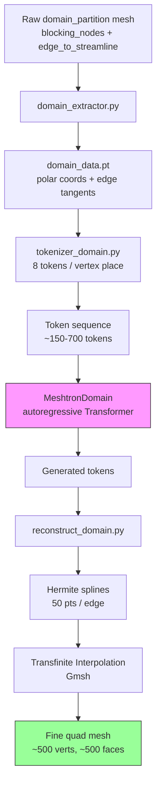

# Meshtron Domain-Partition Extension

> [!note] Projekt-Übersicht
> Erweiterung von Meshtron (autoregressiver Transformer für Quad-Mesh-Generierung) um **Domain-Partition-Prediction mit gekrümmten Kanten**.  
> Statt feiner Quad-Meshes (~2000-8000 Faces) → **grobe Domain-Partitionen** (~6-20 Faces) mit Hermite-Splines + Transfinite Interpolation.

---

## Schnell-Status

| Komponente | Status | Letzter Test | Notizen |
|-----------|--------|-------------|---------|
| Data Extraction | ✅ Fertig | 2026-06-30 | 100 meshes, `domain_data.pt` |
| Tokenizer | ✅ Fertig | 2026-06-30 | 3 Strategies, 3 Modes, sincos |
| Dataset | ✅ Fertig | 2026-06-30 | Batch `[8, 655]` OK |
| Embedding | ✅ Fertig | 2026-06-30 | 3 Modi getestet |
| Modell | ✅ Fertig | 2026-06-30 | Forward pass OK |
| Trainer | ✅ Fertig | 2026-07-01 | Smoke test 2 Epochen OK |
| Inference | ✅ Fertig | 2026-07-01 | Autoregressive sampling OK |
| Rekonstruktion | ✅ Fertig | 2026-06-30 | Hermite + Transfinite round-trip OK |
| **GPU-Training** | 🔴 **Offen** | — | **NÄCHSTER SCHRITT** |
| Geometrische Metriken | 🔴 Offen | — | Chamfer, curvature error |
| Optuna-Sweep | 🔴 Offen | — | 3×3 Strategie×Mode |

---

## Architektur (Mermaid)



---

## Token-Schema (pro Vertex-Platz)

```
[r, θ_sin, θ_cos, t_norm, α_in_sin, α_in_cos, α_out_sin, α_out_cos]
```

- **8 Tokens** pro Vertex-Platz
- **Sincos-Encoding** für Winkel (kein Wrap-around)
- **Polar-Koordinaten** für Rotation-Invarianz
- Special tokens: `start`, `end`, `pad`, `eor`, `sep`

---

## Design-Entscheidungen

> [!success] Festgelegt

| Thema | Entscheidung | Begründung |
|-------|-------------|------------|
| Koordinaten | Polar (r, θ) | Rotation-invariant |
| Winkel-Encoding | Sincos-Paar (2 Tokens) | Kein Wrap-around |
| Tangenten-Quelle | K=3 Streamline-Fit | Robust, einfach |
| Embedding-Modi | 3 Modi (split/shared/separate) | Vergleichbar |
| Validation | Token-Level nur | Geometrisch erst bei Inference |
| Face-Indices | Explicit (Strategy 0/1) | Zuverlässiger |
| Transfinite divisions | External/fixed | Nicht in Transformer-Sequenz |

---

## Offene Aufgaben

> [!todo] Nächste Schritte — Priorisiert

### 🔴 Blocker / Dringend

- [ ] **GPU-Training starten** `priority::critical`
  - Config: d_model=512, n_heads=8, stage_layers=(4,8,12,16,20)
  - 100 Epochen, bf16, batch=16
  - Siehe [[handoff.md]] für genaue Config
  - **Aktion:** Auf GPU-Rechner auschecken → `domain_trainer.py` ausführen

- [ ] **GradScaler-Deprecation fixen** `priority::high`
  - `domain_trainer.py` Zeile 92: `torch.cuda.amp.GradScaler` → `torch.amp.GradScaler('cuda', ...)`

### 🟡 Wichtig

- [ ] **Optuna-Sweep implementieren** `priority::high`
  - Parameter: sorting_strategy [0,1,2], embedding_mode [0,1,2], quantization_r [64,128,256,512]
  - Erstelle `sweep_domain.py` analog zu `sweep.py`
  - [[sweep.py]] als Referenz nutzen

- [ ] **Geometrische Validierungs-Metriken** `priority::medium`
  - Chamfer-Distanz (GT vs generiertes Quad-Mesh)
  - Edge-Curvature-Error (Hermite-Spline-Vergleich)
  - Face-Count-Accuracy
  - Vertex-Position-Error (nach duplicate-merge)
  - Datei: `metrics_domain.py` oder Erweiterung von `metrics.py`

- [ ] **Training-Ergebnisse dokumentieren**
  - Loss-Kurven plotten (`plot_training.py` nutzen)
  - Generierte Meshes visualisieren (`plot_domain_pipeline.py`)
  - Vergleichs-Grid: GT vs Generated

### 🟢 Optional / Langfristig

- [ ] **Strategy 2 vervollständigen** `priority::low`
  - `_build_sequence_vertex_first` ist Stub (ruft Strategy 0 auf)
  - Echter Vertex-first-Mode: alle Vertices → SEP → Faces → SEP → Tangenten
  - Komplexerer Detokenizer nötig

- [ ] **Curriculum Learning** `priority::low`
  - Start mit coarse quantization (z.B. quantization_r=32)
  - Progressive Erhöhung auf 64 → 128 → 256
  - Implementation: `quantization_schedule` im Trainer

- [ ] **Tangenten-Verbesserung** `priority::low`
  - K=5 oder K=10 statt K=3 für glattere Splines
  - Alternative: Tangenten direkt aus Frame-Field berechnen

---

## Experiment-Tracking

> [!note] Laufende & Geplante Experimente

| Experiment | Status | Config | Ergebnis | Notizen |
|-----------|--------|--------|----------|---------|
| Smoke-Test CPU | ✅ Done | d_model=128, 10 epochs | Loss 3.59→0.95 | Sequenzlänge gelernt (~207 vs 208) |
| Smoke-Test Trainer | ✅ Done | d_model=128, 2 epochs | Init + 2 ep OK | Trainer pattern funktioniert |
| **Baseline GPU** | 🔴 Geplant | d_model=512, 100 ep | — | **ERSTES ZIEL** |
| Strategy-Sweep | 🔴 Geplant | 3×3 Grid | — | Nach Baseline |
| Quantization-Sweep | 🔴 Geplant | r=[64,128,256,512] | — | Mit Strategy 0 |

### Metriken, die getrackt werden sollen

- [ ] Train/Val Loss (token-level CE)
- [ ] Perplexity
- [ ] Generated sequence length vs GT
- [ ] Face count accuracy
- [ ] Chamfer distance (geometrisch)
- [ ] Edge curvature RMSE
- [ ] Training time / epoch
- [ ] GPU memory usage

---

## Bekannte Probleme

> [!warning] Bugs & Limitationen

1. **CPU-only Entwicklung** — Alles auf CPU getestet. `bf16` funktioniert nur auf GPU.
2. **Outlier-Meshes** — ~10% der Meshes haben 16-20 Faces (statt 6). Längere Sequenzen (~500-700 Tokens).
3. **Gmsh-Reinitialisierung** — `Transfinite_Interpolation.__init__` ruft `gmsh.initialize()` auf. Mehrfache Instanzen können kollidieren.
4. **Strategy 2 unvollständig** — `_build_sequence_vertex_first` ist Stub.
5. **OpenMesh fehlt** — `half_edge.py` braucht `openmesh`. Domain-Code nutzt pure-Python-Alternative.
6. **GradScaler deprecated** — Zeile 92 in `domain_trainer.py`.

---

## Dateien-Referenz

> [!info] Wichtige Dateien

| Datei | Zweck | Letzte Änderung |
|-------|-------|----------------|
| `domain_extractor.py` | Preprocessing: raw → polar + tangents | 2026-06-30 |
| `tokenizer_domain.py` | Tokenisierung: 3 strategies, 3 modes | 2026-06-30 |
| `dataset_domain.py` | Dataset: point-cloud sampling | 2026-06-30 |
| `domain_embedding.py` | Embedding-Layer wrapper | 2026-06-30 |
| `meshtron_domain.py` | Modell-Definition | 2026-06-30 |
| `domain_trainer.py` | Training-Loop (modern) | 2026-07-01 |
| `inference_domain.py` | Generierung + Rekonstruktion | 2026-07-01 |
| `reconstruct_domain.py` | Hermite-Splines + Transfinite | 2026-06-30 |
| `config.py` | `DomainTrainingConfig` | 2026-07-01 |
| `plot_domain_pipeline.py` | Pipeline-Visualisierung | 2026-06-30 |
| `plot_training.py` | Loss + Token-Plots | 2026-06-30 |
| `handoff.md` | Vollständiger Kontext-Transfer | 2026-07-01 |

---

## Daten-Locations

- **Raw:** `/root/repos/meshtron/checkpoint_mesh_100.pt`
- **Preprocessed:** `/root/repos/meshtron/domain_data.pt`
- **Training-Logs:** `runs_domain/<config-hash>/metrics.jsonl`
- **Checkpoints:** `runs_domain/<config-hash>/best.pt`, `last.pt`
- **Inference-Plots:** `runs_domain/<config-hash>/figures/`

---

## Git-Status

- **Branch:** `domain_partition`
- **Base:** `origin/tokenizer-sorting`
- **Remote:** `github.tik.uni-stuttgart.de:trentschler/meshtron`
- **Letzter Commit:** `609bdb7` — "docs: add handoff.md for context-free continuation"

---

## Daily Log

> [!example] Iterations-Log

### 2026-07-01 — Trainer-Modernisierung & Handoff
- `domain_trainer.py` erstellt — moderner Trainer mit bf16, warmup+cosine, JSONL logging
- `inference_domain.py` erstellt — autoregressive Sampling + Rekonstruktion
- Smoke-Test: 2 Epochen CPU, Trainer init + Training OK
- `handoff.md` erstellt für GPU-Rechner-Handoff
- Branch `domain_partition` gepusht (18 Dateien, +17974 LOC)

### 2026-06-30 — Rekonstruktion & Embedding
- `reconstruct_domain.py` — Hermite-Splines + Transfinite Interpolation round-trip OK
- `domain_embedding.py` — 3 Modi implementiert und getestet
- `meshtron_domain.py` — Modell für kurze Sequenzen + kleine Face counts
- `plot_domain_pipeline.py` — 6-Phase Visualisierung
- Smoke-Test: 10 Epochen CPU, Loss 3.59→0.95, Sequenzlänge gelernt

### 2026-06-29 — Tokenizer & Dataset
- `tokenizer_domain.py` — polar + sincos, 3 strategies, 3 embedding modes
- `dataset_domain.py` — point-cloud sampling, modern MeshData-API
- `domain_extractor.py` — edge_index + edge_tangents Refactor (per-edge statt per-vertex)
- Bugfix: `_order_faces` centroid shape (faces.T statt faces)

---

## Snippets & Schnell-Befehle

> [!tip] Nützliche Code-Snippets

### Training starten
```python
from domain_trainer import DomainTrainer
from config import DomainTrainingConfig

cfg = DomainTrainingConfig(
    data_path='/root/repos/meshtron/domain_data.pt',
    quantization_r=256,
    quantization_a=128,
    sorting_strategy=0,
    embedding_mode=0,
    d_model=512,
    n_heads=8,
    stage_layers=(4, 8, 12, 16, 20),
    n_latents=512,
    batch_size=16,
    num_epochs=100,
    learning_rate=1e-4,
    warmup_steps=1000,
    precision='bf16',
    log_dir='runs_domain',
    save_best=True,
)
trainer = DomainTrainer(cfg)
trainer.run()
```

### Inference testen
```bash
python inference_domain.py \
  --run-dir runs_domain/<config-hash> \
  --ckpt best.pt \
  --temperature 1.0 \
  --transfinite-divisions 5
```

### Branch auschecken (neuer Rechner)
```bash
git fetch origin
git checkout -b domain_partition origin/domain_partition
```

---

## Verwandte Notizen

- [[handoff.md]] — Vollständiger Kontext-Transfer für neue AI
- [[plan.md]] — Ursprünglicher Architektur-Plan
- [[progress.md]] — Detaillierter Fortschritt (alt)
- [[README]] — Projekt-README (wenn vorhanden)
- [[sweep.py]] — Optuna-Sweep Referenz-Implementation
- [[trainer.py]] — Original-Trainer (Referenz)

---

*Letzte Aktualisierung: 2026-07-01*  
*Status: Bereit für GPU-Training*  
*Nächste Aktion: GPU-Training starten → Baseline-Ergebnisse*
